<font size = "5">**VAST Challenge: Mini-Challenge 2**</font>

# Project Brief 

The country of Oceanus has sought FishEye International's help in identifying companies possibly engaged in illegal, unreported, and unregulated (IUU) fishing. Using import/export trade data, FishEye's analysts hope to understand business relationships, including finding links that will help them stop *fishy* IUU activities and protect marine species that are affected by it.

FishEye knows from past experience that companies caught fishing illegally will often shut down then start up again under a different name. Visualising these temporal patterns could thus help in comparing the activities of companies over time to determine if the companies have returned to their nefarious acts.

# Project Objectives

This study thus aims to **visualise temporal patterns for individual entities and between entities from trade records**, and categorize the types of business relationship patterns found through analysis, paying particular attention to abnormalities in to detect  *fishy* trade activities.


```{mermaid}
%%{
  init: {
    'theme': 'base',
    'themeVariables': {
      'primaryColor': '#93c7c2',
      'primaryTextColor': '#fff',
      'primaryBorderColor': '#3d7670',
      'lineColor': '#3d7670',
      'secondaryColor': '#3d7670',
      'tertiaryColor': '#fff'
    }
  }
}%%

flowchart LR
    A{fa:fa-fish-fins \nOverall\nnetwork} -->|patterns?| B(Time)
    B -.- C((?))
    
```


# 1: Data Preparation

::: panel-tabset
## Installing packages


::: {.cell}

```{.r .cell-code  code-fold="false"}
pacman::p_load(jsonlite, tidyverse, DT, lubridate, Hmisc, urbnthemes,
               visNetwork, tidygraph, ggraph, ggiraph, igraph, scales, ggplot2, 
               gganimate, ggstatsplot, ggrain, ggridges, graphlayouts, plotly, patchwork,
               kableExtra, ggpubr, ggrepel)
```
:::


## Loading the json Data

Use `jsonlite` package to read .json files


::: {.cell}

```{.r .cell-code  code-fold="false"}
mc2 <- jsonlite::fromJSON("data/mc2_challenge_graph.json")
```
:::

::: {.cell}

```{.r .cell-code  code-fold="false"}
glimpse(mc2)
```

::: {.cell-output .cell-output-stdout}
```
List of 5
 $ directed  : logi TRUE
 $ multigraph: logi TRUE
 $ graph     : Named list()
 $ nodes     :'data.frame':	34576 obs. of  4 variables:
  ..$ shpcountry: chr [1:34576] "Polarinda" NA "Oceanus" NA ...
  ..$ rcvcountry: chr [1:34576] "Oceanus" NA "Oceanus" NA ...
  ..$ dataset   : chr [1:34576] "MC2" "MC2" "MC2" "MC2" ...
  ..$ id        : chr [1:34576] "AquaDelight Inc and Son's" "BaringoAmerica Marine Ges.m.b.H." "Yu gan  Sea spray GmbH Industrial" "FlounderLeska Marine BV" ...
 $ links     :'data.frame':	5464378 obs. of  9 variables:
  ..$ arrivaldate     : chr [1:5464378] "2034-02-12" "2034-03-13" "2028-02-07" "2028-02-23" ...
  ..$ hscode          : chr [1:5464378] "630630" "630630" "470710" "470710" ...
  ..$ valueofgoods_omu: num [1:5464378] 141015 141015 NA NA NA ...
  ..$ volumeteu       : num [1:5464378] 0 0 0 0 0 0 0 0 0 0 ...
  ..$ weightkg        : int [1:5464378] 4780 6125 10855 11250 11165 11290 9000 19490 6865 19065 ...
  ..$ dataset         : chr [1:5464378] "MC2" "MC2" "MC2" "MC2" ...
  ..$ source          : chr [1:5464378] "AquaDelight Inc and Son's" "AquaDelight Inc and Son's" "AquaDelight Inc and Son's" "AquaDelight Inc and Son's" ...
  ..$ target          : chr [1:5464378] "BaringoAmerica Marine Ges.m.b.H." "BaringoAmerica Marine Ges.m.b.H." "-15045" "-15045" ...
  ..$ valueofgoodsusd : num [1:5464378] NA NA NA NA NA ...
```
:::
:::

:::

::: {.solvebox .solve data-latex="solve"}
**The json file contains 2 dataframes:**

-   **nodes**
    -   34576 observations of 4 variables
    -   shpcountry, rcvcountry, dataset and id
-   **links**
    -   5,464,378 observations of 9 variables
    -   arrivaldate, hscode, valueofgoods_omu, volumeteu, weightkg, dataset, source, target, valueofgoodsusd
:::

**Notes:**\
- **volumeteu:** *TEU (Twenty-foot Equivalent Unit) is a unit of measurement of shipping volume, used to determine cargo capacity for container ships and terminals.*\
- **hscode:** *(Harmonized System Codes) is a standardized numerical method of identifying traded products.*

## 1.1: Splitting data into nodes and edges


::: {.cell}

```{.r .cell-code  code-fold="false"}
mc2_nodes <- as_tibble(mc2$nodes) %>%
    # reorder dataframe columns
  select(id, rcvcountry, shpcountry) %>%
  arrange(id)

mc2_links <- as_tibble(mc2$links) %>%
  # Extract year from date and save as factor column
  mutate(year = as_factor(year(arrivaldate))) %>%
  
  # Move Source and Target to the front
  select(source, target, hscode, year, arrivaldate, weightkg, volumeteu, valueofgoods_omu, valueofgoodsusd)
```
:::


## 1.2: Data Health

Diagnostic checks to survey the extent of "incompleteness" of the data

::: panel-tabset
## **Nodes**

**I. Checking for Missing Values:**


::: {.cell}

```{.r .cell-code  code-fold="false"}
# Check for columns with missing values
colSums(is.na(mc2_nodes))
```

::: {.cell-output .cell-output-stdout}
```
        id rcvcountry shpcountry 
         0       2909      22359 
```
:::
:::


**rcvcountry** has 2909 missing values, and **shpcountry** has 22359 missing values. There are more incomplete records pertaining to origin of the trades. To facilitate analysis, all NA values are replaced by "Unknown":


::: {.cell}

```{.r .cell-code  code-fold="false"}
mc2_nodes <- mc2_nodes %>%
  replace(is.na(mc2_nodes), "Unknown")
```
:::


**II. Checking for Duplicates:**


::: {.cell}

```{.r .cell-code  code-fold="false"}
# Check for duplicated rows
mc2_nodes[duplicated(mc2_nodes),]
```

::: {.cell-output .cell-output-stdout}
```
# A tibble: 0 × 3
# ℹ 3 variables: id <chr>, rcvcountry <chr>, shpcountry <chr>
```
:::
:::


There are no duplicated entries in the nodes tibble.

**III. Assigning unique identifier:**

As the company names are long and may be difficult to use as labels, a numerical universal unique identifier (uuid) is assigned to each company:


::: {.cell}

```{.r .cell-code  code-fold="false"}
# Add unique id for each company
mc2_nodes$uuid <- seq.int(nrow(mc2_nodes))
```
:::


## **Links**

**I. Checking for Missing Values:**


::: {.cell}

```{.r .cell-code  code-fold="false"}
# Check for columns with missing values
colSums(is.na(mc2_links))
```

::: {.cell-output .cell-output-stdout}
```
          source           target           hscode             year 
               0                0                0                0 
     arrivaldate         weightkg        volumeteu valueofgoods_omu 
               0                0           520933          5464097 
 valueofgoodsusd 
         3017844 
```
:::
:::


**valueofgoods_omu** has too many missing values and will unnecessarily skew aggregated values. While some missing values could be intentional non-reporting of value and thus indicate possible IUU, there are too many to be able to filter out based on this criteria alone. This column will be dropped for the analysis, while the relationship between **weightkg**, **volumeteu** and **valueofgoodsusd** will be looked into more closely to check for possible discrepencies. 

**II. Checking for Duplicates:**


::: {.cell}

```{.r .cell-code  code-fold="false"}
# Check for duplicated rows
mc2_links[duplicated(mc2_links),]
```

::: {.cell-output .cell-output-stdout}
```
# A tibble: 155,291 × 9
   source    target hscode year  arrivaldate weightkg volumeteu valueofgoods_omu
   <chr>     <chr>  <chr>  <fct> <chr>          <int>     <dbl>            <dbl>
 1 French C… Mar d… 851629 2028  2028-03-09        20         0               NA
 2 French C… Mar d… 851629 2028  2028-06-02       110         0               NA
 3 French C… -1992  852990 2028  2028-01-02      2830         0               NA
 4 French C… -1992  852990 2028  2028-01-02      2830         0               NA
 5 French C… -1992  852990 2028  2028-01-04      2805         0               NA
 6 French C… -1992  852990 2028  2028-01-11      1895         0               NA
 7 French C… -1992  852990 2028  2028-01-11      2790         0               NA
 8 French C… -1992  852990 2028  2028-01-11      2790         0               NA
 9 French C… -1992  852990 2028  2028-01-18      1895         0               NA
10 French C… -1992  852990 2028  2028-01-18      2790         0               NA
# ℹ 155,281 more rows
# ℹ 1 more variable: valueofgoodsusd <dbl>
```
:::
:::


There are 155,291 duplicated transactions. As these may be indicative of possible  *fishy* activity, the duplicated rows are saved separately as **mc2_links_dup**.


::: {.cell}

```{.r .cell-code  code-fold="false"}
# Save duplicated transactions in a separate tibble
mc2_links_dup <- mc2_links[duplicated(mc2_links),]

# Leave only unique transactions in original edges tibble
mc2_links <- unique(mc2_links)
```
:::

:::

## 1.3: Filtering and Aggregating **links** Variables

::: {.solvebox .solve data-latex="solve"}
**hscode** is an internationally used 6-digit system to classify traded goods, documented by International and Governmental bodies such as the [World Customs Organisation](https://unstats.un.org/wiki/pages/viewpage.action?pageId=87426301) and [United States ITC](https://hts.usitc.gov/current) These different articles/products are coded as subcategories under 99 chapters, with the first 2 digits identifying the chapter that the goods are classified in.
:::


::: {.cell}

```{.r .cell-code}
describe(mc2_links$hscode)
```

::: {.cell-output .cell-output-stdout}
```
mc2_links$hscode 
       n  missing distinct 
 5309087        0     4761 

lowest : 100119 100191 100199 100210 100290, highest: 970300 970400 970500 970600 999999
```
:::
:::


From the code output describing the distribution of **hscode** numbers above (1 - 99), it is not possible to assume that the first number of each 6-digit hscode represents the chapter number identifying type of traded good, as most official hscodes start with a '0'. Products of interest belong to **Chapter 3: Fish and Crustaceans, Molluscs and other Aquatic Invertebrates**, but it is unclear if hscodes beginning with '3' belong to chapter 3 or chapter 30.

The transactions recorded in **mc2_links** are too granular for visualisation, spread across 7 years (2028-2034). The dataframe is grouped by source, target and year-month, to get the number of transactions per traderoute (source-\>target) per month each year.


::: {.cell}

```{.r .cell-code}
mc2_links_agg <- mc2_links %>%
  # Change date to ym format
  mutate(
    yearmonth = floor_date(as_date(arrivaldate), "month")) %>%
  # group by traderoute and yearmonth
  group_by(
    source, target, year, yearmonth) %>%
  summarise(
  # count number of transactions per source-target traderoute per product type per month
    weight = n(),
  # Calculate total weight of export per month per traderoute
    weightkg = sum(weightkg),
  # Calculate total volume in teu per month per traderoute
    volumeteu = sum(volumeteu),
  # Calculate total value in usd per month per traderoute
    valueusd = sum(valueofgoodsusd)
  ) %>%
  filter(
   # Filter to keep traderoutes with more than one transaction
    weight >1,
    # Filter to keep traderoutes between different companies only
    source != target) %>%
  arrange(
    year, yearmonth) %>%
  ungroup()
```
:::


## **Summary Statistics** **I. Trends in number of unique traderoutes (source**  **target) by Year**


::: {.cell}

```{.r .cell-code}
# Aggregating number of routes into new dataframe
routes_by_year <- mc2_links_agg %>%
  # Change month to character
  mutate(yearmonth = format(yearmonth,"%b")) %>%
  # Group by year and month to count frequency of trade routes
  group_by(year, yearmonth) %>%
  summarise(nroutes = n(),
            avgkg = sum(weightkg)/nroutes) %>%
  # Sort by Year-month
  arrange(year, 
  # Manually assign ordinal levels to month to retain order
          factor(yearmonth, levels = c("Jan", "Feb", "Mar", "Apr", 
                            "May", "Jun", "Jul", "Aug", 
                            "Sep", "Oct", "Nov", "Dec"))) %>%
  ungroup()

# Create pivot table to get years as columns 
rby_pivot <- routes_by_year %>%
# Remove avgkg column 
  select(-avgkg) %>%
  pivot_wider(names_from = year,
              values_from = nroutes)

# Manually set order of months in new pivot table
rby_pivot$yearmonth <- factor(rby_pivot$yearmonth, 
                          levels = c("Jan", "Feb", "Mar", "Apr", 
                            "May", "Jun", "Jul", "Aug", 
                            "Sep", "Oct", "Nov", "Dec"))

# List columns (years) to use in plot 
rby_columns <- colnames(rby_pivot)

# Setting default theme for all plots
set_urbn_defaults("print", base_family = "Lato")

# Specify annotation
note1 <- list(
  xref = 'paper',
  yref = 'y',
  x = 0.23,
  y = 8800,
  xanchor = 'left',
  yanchor = 'middle',
  text = "Abnormal Increase in Mar 2030",
  font = list(size = 12,
# color-code annotation to match line color
              color = 'rgb(85,183,72)'),
  showarrow = FALSE)

# Plot trend lines
rby <- plot_ly(
    rby_pivot, 
    x = ~yearmonth
  ) %>%
# Add Trendlines by Year
  add_trace(
    y = ~rby_pivot[[rby_columns[2]]],
    type = 'scatter', 
    mode = 'lines+markers', 
    name = "2028"
  ) %>%
  add_trace(
    y = ~rby_pivot[[rby_columns[3]]],
    type = 'scatter', 
    mode = 'lines+markers', 
    name = "2029"
  ) %>%
  add_trace(
    y = ~rby_pivot[[rby_columns[4]]],
    type = 'scatter', 
    mode = 'lines+markers', 
    name = "2030"
  ) %>%
  add_trace(
    y = ~rby_pivot[[rby_columns[5]]],
    type = 'scatter', 
    mode = 'lines+markers', 
    name = "2031"
  ) %>%
  add_trace(
    y = ~rby_pivot[[rby_columns[6]]],
    type = 'scatter', 
    mode = 'lines+markers', 
    name = "2032"
  ) %>%
  add_trace(
    y = ~rby_pivot[[rby_columns[7]]],
    type = 'scatter', 
    mode = 'lines+markers', 
    name = "2033"
  ) %>%
  add_trace(
    y = ~rby_pivot[[rby_columns[8]]],
    type = 'scatter', 
    mode = 'lines+markers', 
    name = "2034"
  ) %>%
  layout(
    title = "Increasing Trend in Traderoute Count in 2029 and 2033", 
    yaxis = list(title = 'Number of Traderoutes'),
  # Specify blank title to remove x-axis title
    xaxis = list(title = ""),
  # Add top margin to prevent title from being truncated
    margin = list(t = 80),
  # Add annotation to plot
    annotations = note1,
  # Specify plot and background colors
    plot_bgcolor = "#F8F3E6",
    paper_bgcolor = "#F8F3E6"
  ) 

rby
```

::: {.cell-output-display}
```{=html}
<div class="plotly html-widget html-fill-item-overflow-hidden html-fill-item" id="htmlwidget-0ce82d27893e88f4a56e" style="width:100%;height:464px;"></div>
<script type="application/json" data-for="htmlwidget-0ce82d27893e88f4a56e">{"x":{"visdat":{"6014b033f5d":["function () ","plotlyVisDat"]},"cur_data":"6014b033f5d","attrs":{"6014b033f5d":{"x":{},"alpha_stroke":1,"sizes":[10,100],"spans":[1,20],"y":{},"type":"scatter","mode":"lines+markers","name":"2028","inherit":true},"6014b033f5d.1":{"x":{},"alpha_stroke":1,"sizes":[10,100],"spans":[1,20],"y":{},"type":"scatter","mode":"lines+markers","name":"2029","inherit":true},"6014b033f5d.2":{"x":{},"alpha_stroke":1,"sizes":[10,100],"spans":[1,20],"y":{},"type":"scatter","mode":"lines+markers","name":"2030","inherit":true},"6014b033f5d.3":{"x":{},"alpha_stroke":1,"sizes":[10,100],"spans":[1,20],"y":{},"type":"scatter","mode":"lines+markers","name":"2031","inherit":true},"6014b033f5d.4":{"x":{},"alpha_stroke":1,"sizes":[10,100],"spans":[1,20],"y":{},"type":"scatter","mode":"lines+markers","name":"2032","inherit":true},"6014b033f5d.5":{"x":{},"alpha_stroke":1,"sizes":[10,100],"spans":[1,20],"y":{},"type":"scatter","mode":"lines+markers","name":"2033","inherit":true},"6014b033f5d.6":{"x":{},"alpha_stroke":1,"sizes":[10,100],"spans":[1,20],"y":{},"type":"scatter","mode":"lines+markers","name":"2034","inherit":true}},"layout":{"margin":{"b":40,"l":60,"t":80,"r":10},"title":"Increasing Trend in Traderoute Count in 2029 and 2033","yaxis":{"domain":[0,1],"automargin":true,"title":"Number of Traderoutes"},"xaxis":{"domain":[0,1],"automargin":true,"title":"","type":"category","categoryorder":"array","categoryarray":["Jan","Feb","Mar","Apr","May","Jun","Jul","Aug","Sep","Oct","Nov","Dec"]},"annotations":[{"xref":"paper","yref":"y","x":0.23,"y":8800,"xanchor":"left","yanchor":"middle","text":"Abnormal Increase in Mar 2030","font":{"size":12,"color":"rgb(85,183,72)"},"showarrow":false},{"xref":"paper","yref":"y","x":0.23,"y":8800,"xanchor":"left","yanchor":"middle","text":"Abnormal Increase in Mar 2030","font":{"size":12,"color":"rgb(85,183,72)"},"showarrow":false}],"plot_bgcolor":"#F8F3E6","paper_bgcolor":"#F8F3E6","hovermode":"closest","showlegend":true},"source":"A","config":{"modeBarButtonsToAdd":["hoverclosest","hovercompare"],"showSendToCloud":false},"data":[{"x":["Jan","Feb","Mar","Apr","May","Jun","Jul","Aug","Sep","Oct","Nov","Dec"],"y":[7604,7778,6637,7450,8067,8077,8338,8806,8356,8033,8036,7948],"type":"scatter","mode":"lines+markers","name":"2028","marker":{"color":"rgba(31,119,180,1)","line":{"color":"rgba(31,119,180,1)"}},"error_y":{"color":"rgba(31,119,180,1)"},"error_x":{"color":"rgba(31,119,180,1)"},"line":{"color":"rgba(31,119,180,1)"},"xaxis":"x","yaxis":"y","frame":null},{"x":["Jan","Feb","Mar","Apr","May","Jun","Jul","Aug","Sep","Oct","Nov","Dec"],"y":[8249,7066,7082,7885,8165,8175,8397,8642,8704,8785,8365,8341],"type":"scatter","mode":"lines+markers","name":"2029","marker":{"color":"rgba(255,127,14,1)","line":{"color":"rgba(255,127,14,1)"}},"error_y":{"color":"rgba(255,127,14,1)"},"error_x":{"color":"rgba(255,127,14,1)"},"line":{"color":"rgba(255,127,14,1)"},"xaxis":"x","yaxis":"y","frame":null},{"x":["Jan","Feb","Mar","Apr","May","Jun","Jul","Aug","Sep","Oct","Nov","Dec"],"y":[7988,7850,8822,7649,8390,8416,8453,8664,8076,8047,7829,7671],"type":"scatter","mode":"lines+markers","name":"2030","marker":{"color":"rgba(44,160,44,1)","line":{"color":"rgba(44,160,44,1)"}},"error_y":{"color":"rgba(44,160,44,1)"},"error_x":{"color":"rgba(44,160,44,1)"},"line":{"color":"rgba(44,160,44,1)"},"xaxis":"x","yaxis":"y","frame":null},{"x":["Jan","Feb","Mar","Apr","May","Jun","Jul","Aug","Sep","Oct","Nov","Dec"],"y":[8356,7777,6813,7309,8225,7935,8198,8413,7685,7912,7667,7849],"type":"scatter","mode":"lines+markers","name":"2031","marker":{"color":"rgba(214,39,40,1)","line":{"color":"rgba(214,39,40,1)"}},"error_y":{"color":"rgba(214,39,40,1)"},"error_x":{"color":"rgba(214,39,40,1)"},"line":{"color":"rgba(214,39,40,1)"},"xaxis":"x","yaxis":"y","frame":null},{"x":["Jan","Feb","Mar","Apr","May","Jun","Jul","Aug","Sep","Oct","Nov","Dec"],"y":[7594,7074,6440,7454,7703,7583,8212,8167,7628,7515,7503,7470],"type":"scatter","mode":"lines+markers","name":"2032","marker":{"color":"rgba(148,103,189,1)","line":{"color":"rgba(148,103,189,1)"}},"error_y":{"color":"rgba(148,103,189,1)"},"error_x":{"color":"rgba(148,103,189,1)"},"line":{"color":"rgba(148,103,189,1)"},"xaxis":"x","yaxis":"y","frame":null},{"x":["Jan","Feb","Mar","Apr","May","Jun","Jul","Aug","Sep","Oct","Nov","Dec"],"y":[7878,7267,6366,6892,7854,8039,8204,8002,7955,8336,7894,8108],"type":"scatter","mode":"lines+markers","name":"2033","marker":{"color":"rgba(140,86,75,1)","line":{"color":"rgba(140,86,75,1)"}},"error_y":{"color":"rgba(140,86,75,1)"},"error_x":{"color":"rgba(140,86,75,1)"},"line":{"color":"rgba(140,86,75,1)"},"xaxis":"x","yaxis":"y","frame":null},{"x":["Jan","Feb","Mar","Apr","May","Jun","Jul","Aug","Sep","Oct","Nov","Dec"],"y":[7840,6956,6681,7219,7487,7520,7773,7490,6894,6669,6844,6563],"type":"scatter","mode":"lines+markers","name":"2034","marker":{"color":"rgba(227,119,194,1)","line":{"color":"rgba(227,119,194,1)"}},"error_y":{"color":"rgba(227,119,194,1)"},"error_x":{"color":"rgba(227,119,194,1)"},"line":{"color":"rgba(227,119,194,1)"},"xaxis":"x","yaxis":"y","frame":null}],"highlight":{"on":"plotly_click","persistent":false,"dynamic":false,"selectize":false,"opacityDim":0.2,"selected":{"opacity":1},"debounce":0},"shinyEvents":["plotly_hover","plotly_click","plotly_selected","plotly_relayout","plotly_brushed","plotly_brushing","plotly_clickannotation","plotly_doubleclick","plotly_deselect","plotly_afterplot","plotly_sunburstclick"],"base_url":"https://plot.ly"},"evals":[],"jsHooks":[]}</script>
```
:::
:::


## **II. Trends in Average Weight (kg) of Exports by Year**


::: {.cell}

```{.r .cell-code}
# Create pivot table to get years as columns 
kgby_pivot <- routes_by_year %>%
# Remove nroutes column 
  select(-nroutes) %>%
  pivot_wider(names_from = year,
              values_from = avgkg)

# Manually set order of months in new pivot table
kgby_pivot$yearmonth <- factor(kgby_pivot$yearmonth, 
                          levels = c("Jan", "Feb", "Mar", "Apr", 
                            "May", "Jun", "Jul", "Aug", 
                            "Sep", "Oct", "Nov", "Dec"))

# List columns (years) to use in plot 
kgby_columns <- colnames(kgby_pivot)

# Plot trend lines
kgby <- plot_ly(
    kgby_pivot, 
    x = ~yearmonth
  ) %>%
# Add Trendlines by Year
  add_trace(
    y = ~kgby_pivot[[kgby_columns[2]]],
    type = 'scatter', 
    mode = 'lines', 
    name = "2028"
  ) %>%
  add_trace(
    y = ~kgby_pivot[[kgby_columns[3]]],
    type = 'scatter', 
    mode = 'lines', 
    name = "2029"
  ) %>%
  add_trace(
    y = ~kgby_pivot[[kgby_columns[4]]],
    type = 'scatter', 
    mode = 'lines', 
    name = "2030"
  ) %>%
  add_trace(
    y = ~kgby_pivot[[kgby_columns[5]]],
    type = 'scatter', 
    mode = 'lines', 
    name = "2031"
  ) %>%
  add_trace(
    y = ~kgby_pivot[[kgby_columns[6]]],
    type = 'scatter', 
    mode = 'lines', 
    name = "2032"
  ) %>%
  add_trace(
    y = ~kgby_pivot[[kgby_columns[7]]],
    type = 'scatter', 
    mode = 'lines', 
    name = "2033"
  ) %>%
  add_trace(
    y = ~kgby_pivot[[kgby_columns[8]]],
    type = 'scatter', 
    mode = 'lines', 
    name = "2034"
  ) %>%
  layout(
    title = "Fluctuations in Average Trade Weights Across each Year", 
    yaxis = list(title = 'Average Weight of Trade (kg)'),
  # Specify blank title to remove x-axis title
    xaxis = list(title = ""),
  # Add top margin to prevent title from being truncated
    margin = list(t = 80),
  # Specify plot and background colors
    plot_bgcolor = "#F8F3E6",
    paper_bgcolor = "#F8F3E6"
  )

kgby
```

::: {.cell-output-display}
```{=html}
<div class="plotly html-widget html-fill-item-overflow-hidden html-fill-item" id="htmlwidget-cd30fb9b550223287e52" style="width:100%;height:464px;"></div>
<script type="application/json" data-for="htmlwidget-cd30fb9b550223287e52">{"x":{"visdat":{"60146c174df2":["function () ","plotlyVisDat"]},"cur_data":"60146c174df2","attrs":{"60146c174df2":{"x":{},"alpha_stroke":1,"sizes":[10,100],"spans":[1,20],"y":{},"type":"scatter","mode":"lines","name":"2028","inherit":true},"60146c174df2.1":{"x":{},"alpha_stroke":1,"sizes":[10,100],"spans":[1,20],"y":{},"type":"scatter","mode":"lines","name":"2029","inherit":true},"60146c174df2.2":{"x":{},"alpha_stroke":1,"sizes":[10,100],"spans":[1,20],"y":{},"type":"scatter","mode":"lines","name":"2030","inherit":true},"60146c174df2.3":{"x":{},"alpha_stroke":1,"sizes":[10,100],"spans":[1,20],"y":{},"type":"scatter","mode":"lines","name":"2031","inherit":true},"60146c174df2.4":{"x":{},"alpha_stroke":1,"sizes":[10,100],"spans":[1,20],"y":{},"type":"scatter","mode":"lines","name":"2032","inherit":true},"60146c174df2.5":{"x":{},"alpha_stroke":1,"sizes":[10,100],"spans":[1,20],"y":{},"type":"scatter","mode":"lines","name":"2033","inherit":true},"60146c174df2.6":{"x":{},"alpha_stroke":1,"sizes":[10,100],"spans":[1,20],"y":{},"type":"scatter","mode":"lines","name":"2034","inherit":true}},"layout":{"margin":{"b":40,"l":60,"t":80,"r":10},"title":"Fluctuations in Average Trade Weights Across each Year","yaxis":{"domain":[0,1],"automargin":true,"title":"Average Weight of Trade (kg)"},"xaxis":{"domain":[0,1],"automargin":true,"title":"","type":"category","categoryorder":"array","categoryarray":["Jan","Feb","Mar","Apr","May","Jun","Jul","Aug","Sep","Oct","Nov","Dec"]},"plot_bgcolor":"#F8F3E6","paper_bgcolor":"#F8F3E6","hovermode":"closest","showlegend":true},"source":"A","config":{"modeBarButtonsToAdd":["hoverclosest","hovercompare"],"showSendToCloud":false},"data":[{"x":["Jan","Feb","Mar","Apr","May","Jun","Jul","Aug","Sep","Oct","Nov","Dec"],"y":[245479.036691215,170513.358189766,192523.935513033,241885.093288591,222271.281765216,190548.25058809,196756.445790357,228474.850669998,179488.842149354,309883.93999751,241905.894101543,226972.9032461],"type":"scatter","mode":"lines","name":"2028","marker":{"color":"rgba(31,119,180,1)","line":{"color":"rgba(31,119,180,1)"}},"error_y":{"color":"rgba(31,119,180,1)"},"error_x":{"color":"rgba(31,119,180,1)"},"line":{"color":"rgba(31,119,180,1)"},"xaxis":"x","yaxis":"y","frame":null},{"x":["Jan","Feb","Mar","Apr","May","Jun","Jul","Aug","Sep","Oct","Nov","Dec"],"y":[170740.553400412,380700.977922446,440962.775345947,173637.207989854,239347.203306797,281909.087461774,305367.28355365,368313.915760241,238144.856387868,248261.348890154,251196.533173939,221186.614914279],"type":"scatter","mode":"lines","name":"2029","marker":{"color":"rgba(255,127,14,1)","line":{"color":"rgba(255,127,14,1)"}},"error_y":{"color":"rgba(255,127,14,1)"},"error_x":{"color":"rgba(255,127,14,1)"},"line":{"color":"rgba(255,127,14,1)"},"xaxis":"x","yaxis":"y","frame":null},{"x":["Jan","Feb","Mar","Apr","May","Jun","Jul","Aug","Sep","Oct","Nov","Dec"],"y":[249049.110540811,222946.399363057,228224.147018817,321069.392077396,226702.006555423,302245.154467681,342124.775819236,265638.916782087,368965.44205052,455092.746365105,274961.971516158,193460.722200495],"type":"scatter","mode":"lines","name":"2030","marker":{"color":"rgba(44,160,44,1)","line":{"color":"rgba(44,160,44,1)"}},"error_y":{"color":"rgba(44,160,44,1)"},"error_x":{"color":"rgba(44,160,44,1)"},"line":{"color":"rgba(44,160,44,1)"},"xaxis":"x","yaxis":"y","frame":null},{"x":["Jan","Feb","Mar","Apr","May","Jun","Jul","Aug","Sep","Oct","Nov","Dec"],"y":[238728.929511728,249852.17307445,256166.492000587,226684.174305651,239155.445592705,177087.640201638,233175.223225177,218589.08891002,191973.142485361,247873.38346815,243293.853528107,212469.009427953],"type":"scatter","mode":"lines","name":"2031","marker":{"color":"rgba(214,39,40,1)","line":{"color":"rgba(214,39,40,1)"}},"error_y":{"color":"rgba(214,39,40,1)"},"error_x":{"color":"rgba(214,39,40,1)"},"line":{"color":"rgba(214,39,40,1)"},"xaxis":"x","yaxis":"y","frame":null},{"x":["Jan","Feb","Mar","Apr","May","Jun","Jul","Aug","Sep","Oct","Nov","Dec"],"y":[209770.888859626,233935.04028838,229680.533385093,267547.068687953,233500.694534597,351411.25478043,256396.442401364,653660.029386556,285285.926192973,487119.699933466,246755.217246435,605080.81793842],"type":"scatter","mode":"lines","name":"2032","marker":{"color":"rgba(148,103,189,1)","line":{"color":"rgba(148,103,189,1)"}},"error_y":{"color":"rgba(148,103,189,1)"},"error_x":{"color":"rgba(148,103,189,1)"},"line":{"color":"rgba(148,103,189,1)"},"xaxis":"x","yaxis":"y","frame":null},{"x":["Jan","Feb","Mar","Apr","May","Jun","Jul","Aug","Sep","Oct","Nov","Dec"],"y":[191525.875222138,187544.162653089,277931.486019478,256874.064132327,276460.176343265,192698.249160343,496765.808751828,491743.310422394,187301.793211816,196007.084932821,193052.693184697,186265.740009867],"type":"scatter","mode":"lines","name":"2033","marker":{"color":"rgba(140,86,75,1)","line":{"color":"rgba(140,86,75,1)"}},"error_y":{"color":"rgba(140,86,75,1)"},"error_x":{"color":"rgba(140,86,75,1)"},"line":{"color":"rgba(140,86,75,1)"},"xaxis":"x","yaxis":"y","frame":null},{"x":["Jan","Feb","Mar","Apr","May","Jun","Jul","Aug","Sep","Oct","Nov","Dec"],"y":[262231.31122449,204300.410437033,264490.267175573,221270.979360022,207266.382396153,199095.924202128,177288.044513058,228346.644859813,221737.682042356,195189.979007347,185013.763880771,210451.781197623],"type":"scatter","mode":"lines","name":"2034","marker":{"color":"rgba(227,119,194,1)","line":{"color":"rgba(227,119,194,1)"}},"error_y":{"color":"rgba(227,119,194,1)"},"error_x":{"color":"rgba(227,119,194,1)"},"line":{"color":"rgba(227,119,194,1)"},"xaxis":"x","yaxis":"y","frame":null}],"highlight":{"on":"plotly_click","persistent":false,"dynamic":false,"selectize":false,"opacityDim":0.2,"selected":{"opacity":1},"debounce":0},"shinyEvents":["plotly_hover","plotly_click","plotly_selected","plotly_relayout","plotly_brushed","plotly_brushing","plotly_clickannotation","plotly_doubleclick","plotly_deselect","plotly_afterplot","plotly_sunburstclick"],"base_url":"https://plot.ly"},"evals":[],"jsHooks":[]}</script>
```
:::
:::


::: {.focusbox .focus data-latex="focus"}
**Insights from LineChart:**

-   Abnormal increase in traderoute count in Mar 2030\
-   No regularly coinciding 'peaks' to suggest seasonal trends (through changes in export weight) across the years

To determine if there are specific companies or traderoutes accounting for a high percentage of these spikes in trade volume, **it would be useful to visualise and compare tradecount and export weight of the highest contributors over the years.** This is to investigate if the spikes are attributed to specific companies or traderoutes, or just an overall increase in numbers or trade volume across the board (pointing to increases in demand instead of *fishy* activity).
:::

## 1.4: Classifying Companies based on trade records

Companies' trade records are flagged as "suspicious" or "normal" based on the following logic:

| **Tradecount** | **Traded<br>Product Weight(kg)** | **Trade <br>Value ($usd)** | **Flag**   |
|----------------|----------------------------------|----------------------------|------------|
| High           | -                                | 0                          | suspicious |
| -              | High                             | 0                          | suspicious |
| Low            | -                                | High                       | suspicious |


::: {.cell}

```{.r .cell-code  code-fold="false"}
# Aggregate values based on traderoute (source-target)
mc2_links_class <- mc2_links_agg %>%
  group_by(source, target) %>%
  summarise(weight = sum(weight),
            weightkg = sum(weightkg),
            valueusd = sum(valueusd, na.rm = TRUE)) %>%
  ungroup()

# Apply ifelse conditions to classify traderecord
mc2_links_class$tradeRecord <- 
  ifelse(
    # High tradecount, no recorded trade value
    mc2_links_class$weight > quantile(mc2_links_class$weight, .75) & mc2_links_class$valueusd == 0 |
    # High traded product weight, no recorded trade value 
    mc2_links_class$weightkg > quantile(mc2_links_class$weightkg, .75) & mc2_links_class$valueusd == 0 |
    # High recorded trade value, low tradecount
    mc2_links_class$valueusd > quantile(mc2_links_class$valueusd, .75) & mc2_links_class$weight < quantile(mc2_links_class$weight, .25), 
    "suspicious", "normal"
  )
```
:::


# 2: **Exploring**  **Fishy Data Patterns**

From the Summary Statistics and preliminary visualisations in Section 1.4, traderoutes will be investigated based on abnormalities in temporal trends across number of trades and export weight. The analysis will focus on visualising networks based on filtered records:


```{mermaid}
%%{
  init: {
    'theme': 'base',
    'themeVariables': {
      'primaryColor': '#93c7c2',
      'primaryTextColor': '#fff',
      'primaryBorderColor': '#3d7670',
      'lineColor': '#3d7670',
      'secondaryColor': '#3d7670',
      'tertiaryColor': '#fff'
    }
  }
}%%

flowchart LR
    A{fa:fa-fish-fins \nOverall\nnetwork} ==> B((Country\nLevel))
    A ==> C((Company\nLevel))
    C -.- D{fa:fa-calendar-days \nTime} -->|patterns?| E(trade frequency)
    B -.- D -->|patterns?| F(trade weight)
    D -->|patterns?| G(trade value\n$usd)

```


## **2.1 Country Level Trade Networks**

In order to get plot a network graph detailing links between countries, new links and nodes dataframes have to be created from existing data.


::: {.cell}

```{.r .cell-code  code-fold="false"}
country_links <- mc2_links_agg %>%
  # Match source company to nodes to get shipping origin country
  inner_join(mc2_nodes, by = join_by("source" == "id")) %>%
  # Use shpcountry as source, rcvcountry as target for links
  select(shpcountry, rcvcountry, year, yearmonth, weight, weightkg) %>%
  filter(shpcountry != rcvcountry)
```
:::


### **2.1.1: Investigating 2030 data**

From the summary statistics outlined in Section 1, there was an observed abnormal increase in tradecount in March 2030. Trade records from 2030 are thus filtered out for investigation:

::: panel-tabset
## **Step 1: Filter records belonging to year 2030**


::: {.cell}

```{.r .cell-code  code-fold="false"}
country_links_2030 <- country_links %>%
  filter(year == "2030") %>%
  group_by(shpcountry, rcvcountry, yearmonth) %>%
  summarise(weight = sum(weight),
            weightkg = sum(weightkg)) %>%
  filter(shpcountry != rcvcountry) %>%
  ungroup()
```
:::


## **Step 2: Create country nodes**


::: {.cell}

```{.r .cell-code  code-fold="false"}
distinct_shpcountry <- country_links_2030 %>%
    distinct(shpcountry) %>%
    mutate(country = shpcountry) %>%
    select(country)

distinct_rcvcountry <- country_links_2030 %>%
    distinct(rcvcountry) %>%
    mutate(country = rcvcountry) %>%
    select(country)

country_nodes_2030 <- unique(rbind(distinct_shpcountry, distinct_rcvcountry))
```
:::


## **Step 3: Create Country Graph object**


::: {.cell}

```{.r .cell-code  code-fold="false"}
country_graph_2030 <- tbl_graph(nodes = country_nodes_2030,
                          edges = country_links_2030, 
                          directed = TRUE)
country_graph_2030
```

::: {.cell-output .cell-output-stdout}
```
# A tbl_graph: 137 nodes and 4439 edges
#
# A directed multigraph with 1 component
#
# A tibble: 137 × 1
  country   
  <chr>     
1 -22004    
2 -22005    
3 -22007    
4 Alverossia
5 Alverovia 
6 Andenovia 
# ℹ 131 more rows
#
# A tibble: 4,439 × 5
   from    to yearmonth  weight weightkg
  <int> <int> <date>      <int>    <dbl>
1     1    75 2030-01-01      6   580805
2     1    75 2030-02-01      9  1732215
3     1    75 2030-03-01      2   252950
# ℹ 4,436 more rows
```
:::
:::

:::

## **Step 4: Visualise country trade network for 2030:**


::: {.cell}

```{.r .cell-code}
# Measure directed out-degree centrality and save as a column
V(country_graph_2030)$out_degree <- degree(country_graph_2030, mode = "out")

set.seed(1234)
g2030 <- country_graph_2030 %>%
  activate(edges) %>%
  mutate(yearmonth = factor(format(yearmonth, "%b"),
                            levels = c("Jan", "Feb", "Mar", "Apr", 
                            "May", "Jun", "Jul", "Aug", 
                            "Sep", "Oct", "Nov", "Dec"))) %>%
  ggraph(layout = "linear",
         circular = TRUE) +
  geom_edge_fan(
    aes(width = weight,
        color = yearmonth),
    alpha = .6,
    arrow = arrow(length = unit(2, 'mm')),
    show.legend = FALSE
  ) +
  scale_edge_width(
    range = c(0.1,4)
  ) +
  geom_node_point(
    aes(size = out_degree),
    color = "grey20",
    alpha = .7,
    show.legend = FALSE
  ) +
  geom_node_text(
    aes(label = ifelse(out_degree > quantile(out_degree, .75), country, "")), 
    size = 3,
    repel = TRUE
  ) +
  theme(
    plot.title = element_text(size = 16,
                              color = "grey20"),
    legend.title = element_text(),
    plot.background = element_rect(fill="#F8F3E6",colour="#F8F3E6")
  ) +
  transition_states(yearmonth,
                    transition_length = 6,
                    state_length = 4
  ) +
  labs(
    title = "Country-level Trade Network in {closest_state} 2030",
    subtitle = "Larger nodes have higher Out-Degree Centrality. Countries with the most export routes are identified: "
  ) +
  enter_fade() +
  exit_fade()

g2030
```

::: {.cell-output-display}

:::
:::


::: {.focusbox .focus data-latex="focus"}

**Insights from Network Graph:**

There are no visually *fishy* patterns identified in March 2030, compared to the other months. The links with thicker widths represent higher number of traderoutes -- these have largely remained the same throughout the year. This suggests that the abnormal increase could be detected at a company-level instead of a country-level network analysis. **However, more information is first gathered from country-level traderoute activities to sieve out possible flags for IUU activity.**  
:::

## **2.1.2: Visualising Records Across the Years**

**Which countries have the heaviest trade activities?** Plotting an overall network graph would result in a dense web of links with little analytical value. To detect *fishy* temporal patterns, countries that have higher traderoute counts are used for the network analysis.  


::: {.panel-tabset}

## **Step 1: Filter countries in top 1000 by Traderoute count**


::: {.cell}

```{.r .cell-code  code-fold="false"}
# Filtering out countries by weight
country_links_top <- top_n(country_links, 1000, weight)
```
:::


## **Step 2: Create Country Nodes and Graph Object**


::: {.cell}

```{.r .cell-code  code-fold="false"}
# Getting unique country names from links data
distinct_shpcountry_all <- country_links_top %>%
    distinct(shpcountry) %>%
    mutate(country = shpcountry) %>%
    select(country)

distinct_rcvcountry_all <- country_links_top %>%
    distinct(rcvcountry) %>%
    mutate(country = rcvcountry) %>%
    select(country)

# Creating nodes list from combined links data
country_nodes <- unique(rbind(distinct_shpcountry_all, distinct_rcvcountry_all))

# Create Graph Object
country_graph <- tbl_graph(nodes = country_nodes,
                          edges = country_links_top, 
                          directed = TRUE)
country_graph
```

::: {.cell-output .cell-output-stdout}
```
# A tbl_graph: 24 nodes and 1005 edges
#
# A directed acyclic multigraph with 2 components
#
# A tibble: 24 × 1
  country   
  <chr>     
1 Marebak   
2 Rio Isla  
3 Kondanovia
4 Alverossia
5 Merigrad  
6 Utoporiana
# ℹ 18 more rows
#
# A tibble: 1,005 × 6
   from    to year  yearmonth  weight weightkg
  <int> <int> <fct> <date>      <int>    <dbl>
1     1    17 2028  2028-01-01    435  7607660
2     1    17 2028  2028-01-01    199  3353530
3     2    18 2028  2028-01-01    307 24667540
# ℹ 1,002 more rows
```
:::
:::


:::

**I. Out-degree centrality (Visualising top Exports)**


::: {.cell}

```{.r .cell-code}
# Measure directed out-degree centrality and save as a column
V(country_graph)$out_degree <- degree(country_graph, mode = "out")

set.seed(1234)
g_out <- country_graph %>%
  ggraph(layout = "kk"
  )+
  geom_edge_fan(
    aes(width = weight,
        color = year),
    alpha = .6,
    arrow = arrow(length = unit(2, 'mm')),
    show.legend = FALSE
  ) +
  scale_edge_width(
    range = c(0.1,4)
  ) +
  geom_node_point(
    aes(size = out_degree),
    color = "grey20",
    show.legend = FALSE
  ) +
  geom_node_text(
    aes(label = ifelse(out_degree > quantile(out_degree, .5), country, "")), 
    size = 3,
    nudge_x = .5
  ) +
  theme(
    plot.title = element_text(size = 20,
                              color = "grey20"),
    legend.title = element_text(),
    plot.background = element_rect(fill="#F8F3E6",colour="#F8F3E6"),
    plot.margin = margin(r = 15,
                         l = 15)
  ) +
  transition_states(year,
                    transition_length = 3,
                    state_length = 4
  ) +
  labs(
    title = "Country Trade Network for Year {closest_state}",
    subtitle = "Larger nodes have higher Out-Degree Centrality"
  ) +
  enter_fade() +
  exit_fade()

g_out
```

::: {.cell-output-display}
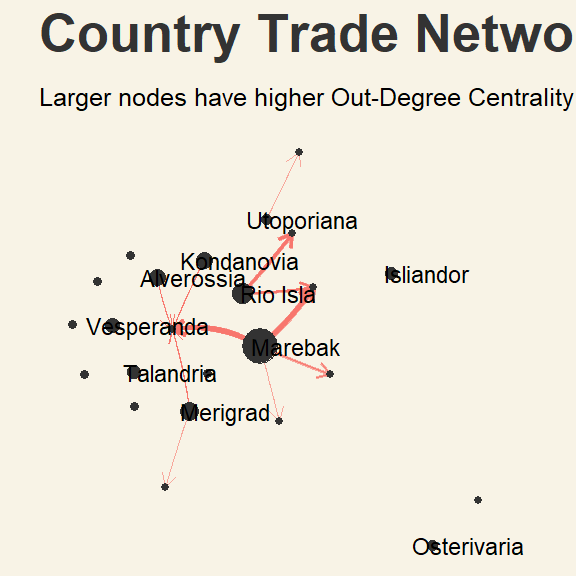
:::
:::


**II. In-degree centrality (Visualising top Imports)**


::: {.cell}

```{.r .cell-code}
# Measure directed out-degree centrality and save as a column
V(country_graph)$in_degree <- degree(country_graph, mode = "in")

set.seed(1234)
g_in <- country_graph %>%
  ggraph(layout = "kk"
  )+
  geom_edge_fan(
    aes(width = weight,
        color = year),
    alpha = .6,
    arrow = arrow(length = unit(2, 'mm')),
    show.legend = FALSE
  ) +
  scale_edge_width(
    range = c(0.1,4)
  ) +
  geom_node_point(
    aes(size = in_degree),
    color = "grey20",
    show.legend = FALSE
  ) +
  geom_node_text(
    aes(label = ifelse(in_degree > quantile(in_degree, .5), country, "")), 
    size = 3,
    nudge_x = .5
  ) +
  theme(
    plot.title = element_text(size = 16,
                              color = "grey20"),
    legend.title = element_text(),
    plot.background = element_rect(fill="#F8F3E6",colour="#F8F3E6"),
    plot.margin = margin(r = 15,
                         l = 15)
  ) +
  transition_states(year,
                    transition_length = 3,
                    state_length = 4
  ) +
  labs(
    title = "Country Trade Network for Year {closest_state}",
    subtitle = "Larger nodes have higher In-Degree Centrality. Countries with the most imports are identified:"
  ) +
  enter_fade() +
  exit_fade()

g_in
```

::: {.cell-output-display}
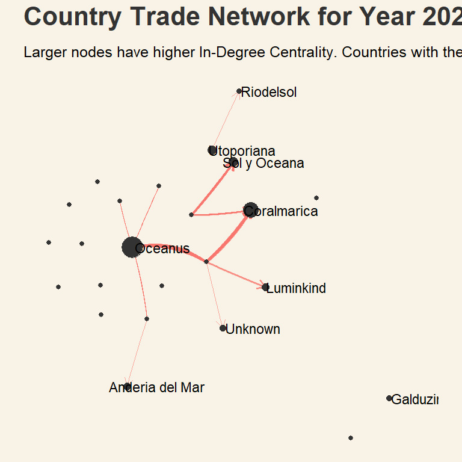
:::
:::


**III. Betweenness Centrality**


::: {.cell}

```{.r .cell-code}
# Calculate betweenness centrality and save values to new column
country_graph <- country_graph %>%
  mutate(betweenness = centrality_betweenness())

set.seed(1234)
g_bc <- country_graph %>%
  ggraph(
    layout = "kk") +
  geom_edge_fan(
    aes(width = weight,
        color = year),
    alpha = .6,
    arrow = arrow(length = unit(2, 'mm')),
    show.legend = FALSE
  ) +
  scale_edge_width(
    range = c(0.1,4)
  ) +
  geom_node_point(
    aes(size = betweenness),
    color = "grey20"
  ) +
  geom_node_text(
    aes(label = ifelse(betweenness > quantile(betweenness, .5), country, "")), 
    size = 3,
    nudge_y = .3
  ) +
  theme(
    plot.title = element_text(size = 16,
                              color = "grey20"),
    legend.position = "bottom",
    legend.title = element_text(),
    plot.background = element_rect(fill="#F8F3E6",colour="#F8F3E6"),
    plot.margin = margin(r = 15,
                         l = 15)
  ) +
  transition_states(yearmonth,
                    transition_length = 5,
                    state_length = 5
  ) +
  labs(
    title = "Country Trade Network for Year {closest_state}",
    subtitle = "Utoporiana has the highest Betweenness Centrality,\npossibly acting as intermediary facilitating traderoutes "
  ) +
  enter_fade() +
  exit_fade()

g_bc
```

::: {.cell-output-display}
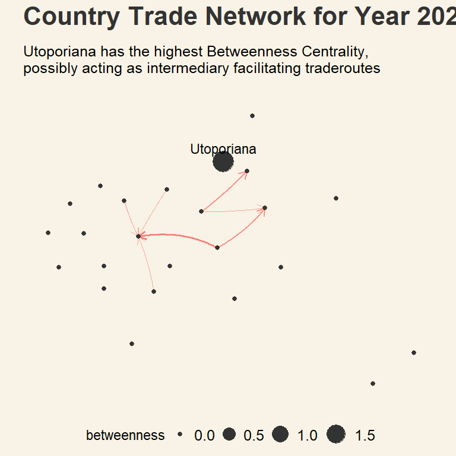
:::
:::


**IV. Eigenvector Centrality**


::: {.cell}

```{.r .cell-code}
# Calculate eigenvector centrality and save values to new column
ec <- eigen_centrality(country_graph)$vector
V(country_graph)$eigencentrality <- ec

set.seed(1234)
g_ec <- country_graph %>%
  ggraph(layout = "kk") +
  geom_edge_fan(
    aes(width = weight,
        color = year),
    alpha = .6,
    arrow = arrow(length = unit(2, 'mm')),
    show.legend = FALSE
  ) +
  scale_edge_width(
    range = c(0.1,4)
  ) +
  geom_node_point(
    aes(size = eigencentrality),
    color = "grey30"
  ) +
  geom_node_text(
    aes(label = ifelse(eigencentrality > quantile(eigencentrality, .5), country, "")), 
    size = 3,
    nudge_y = -.2
  ) +
  theme(
    plot.title = element_text(size = 20,
                              color = "grey20"),
    legend.position = "bottom",
    legend.title = element_text(),
    plot.background = element_rect(fill="#F8F3E6",colour="#F8F3E6"),
    plot.margin = margin(r = 15,
                         l = 15)
  ) +
  transition_states(yearmonth,
                    transition_length = 5,
                    state_length = 5
  ) +
  labs(
    title = "Country Trade Network for Year {closest_state}",
    subtitle = "Oceanus, Marebak and Coralmarica have higher Eigenvector Centrality, 
    \nsuggesting high influence within the overall network"
  ) +
  enter_fade() +
  exit_fade()

g_ec
```

::: {.cell-output-display}
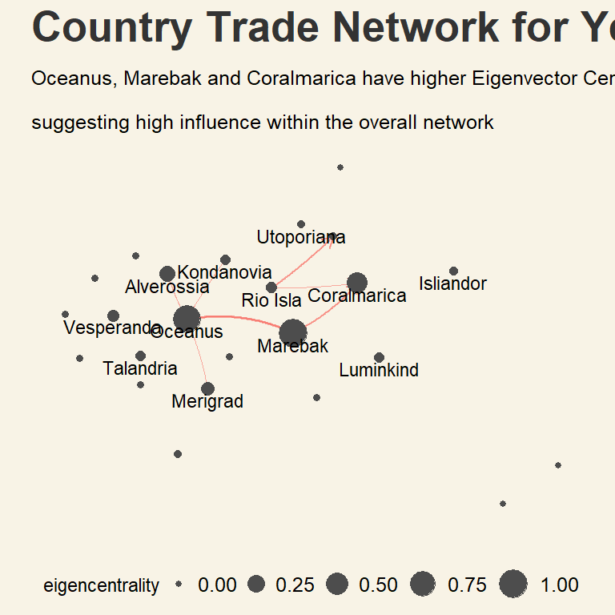
:::
:::


**V. PageRank Score**


::: {.cell}

```{.r .cell-code}
# Calculate PageRank Score and save values to new column
pr <- page_rank(country_graph)$vector
V(country_graph)$pagerank <- pr

set.seed(1234)
g_pr <- country_graph %>%
  ggraph(layout = "linear",
         circular = TRUE) +
  geom_edge_arc(
    aes(width = weight,
        color = year),
    alpha = .5,
    arrow = arrow(length = unit(2, 'mm')),
    show.legend = FALSE
  ) +
  scale_edge_width(
    range = c(0.1,4)
  ) +
  geom_node_point(
    aes(size = pagerank),
    color = "grey30"
  ) +
  geom_node_text(
    aes(label = country), 
    size = 3,
    nudge_y = -.05
  ) +
  theme(
    plot.title = element_text(size = 16,
                              color = "grey20"),
    legend.title = element_text(),
    legend.position = "bottom",
    plot.background = element_rect(fill="#F8F3E6",colour="#F8F3E6"),
    plot.margin = margin(r = 15,
                         l = 15)
  ) +
  transition_states(year,
                    transition_length = 5,
                    state_length = 5
  ) +
  labs(
    title = "Country Trade Network for {closest_state}",
    subtitle = "Oceanus and Utoporiana have highest connectedness to other countries, possibly acting as trade hubs"
  ) +
  enter_fade() +
  exit_fade()

g_pr
```

::: {.cell-output-display}
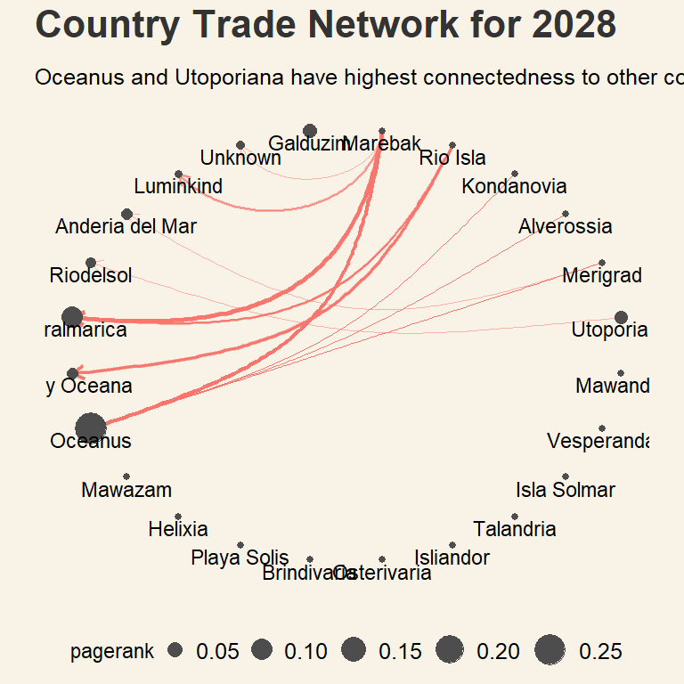
:::
:::


### 2.1.2: Comparing Distribution of Centrality Measures

Data Preparation:


::: {.cell}

```{.r .cell-code}
# Retrieve Centrality measures from nodes
country_centrality <- data.frame(
  OutDegree = V(country_graph)$out_degree,
  InDegree = V(country_graph)$in_degree,
  Betweenness_centrality = V(country_graph)$betweenness,
  Eigenvector_centrality = V(country_graph)$eigencentrality,
  PageRank_score = V(country_graph)$pagerank
)

# Create function to transform variables to same scale (min-max normalisation)
transform_variable <- function(x) {
  (x - min(x)) / (max(x) - min(x))
}

# function to apply scaling across all variables in a dataframe
transform_dataframe <- function(df) {
  df %>%
    mutate(across(where(is.numeric) & !matches("uuid"), transform_variable))
}

# Apply function and save to new dataframe
country_centrality_scaled <- transform_dataframe(country_centrality)

# Pivot longer to get centrality measures as factors
country_centrality_long <- gather(country_centrality_scaled, key = "CentralityMeasure", value = "CentralityScore")
```
:::

::: {.cell}

```{.r .cell-code}
# Density ridges to show distribution of data
ggplot(
    country_centrality_long, 
    aes(x = CentralityScore, 
        y = CentralityMeasure, 
        fill = CentralityMeasure,
        color = CentralityMeasure)
  ) +
  geom_density_ridges(
    alpha = .6,
    scale = 3
  ) +
  geom_rug() +
  labs(
    title = "Similar Distribution of Values Across Centrality Measures",
    subtitle = "Right-skewed distribution with presence of outliers",
    x = "Centrality Score",
    y = "Centrality Measure"
  ) +
  theme(
    legend.position = "none",
    axis.title = element_blank(),
    panel.grid.major = element_blank(),
    plot.background = element_rect(fill="#F8F3E6",colour="#F8F3E6")
  )
```

::: {.cell-output-display}
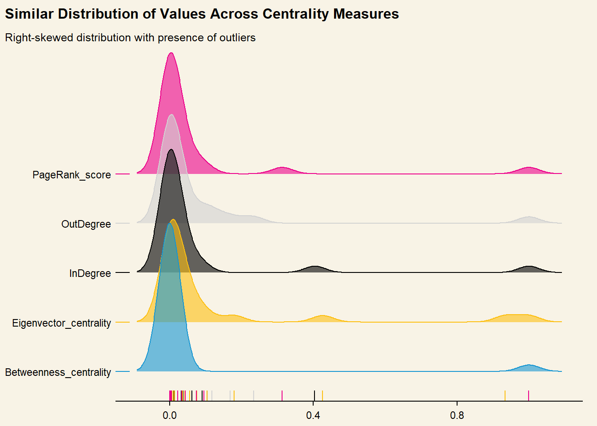{width=672}
:::
:::


::: { .solvebox .solve data-latex="solve}
**Insights from Network Graphs:**
The differences in scores across centrality measures for each country suggests that there are various clusters of networks within the larger trade network, consisting of key Importers, Exporters, Intermediaries/Facilitators and Trade Hubs. **Marebak**, for instance, has a higher Out-Degree and Eigenvector Centrality value, but lower scores on other measures -- this suggests that the country is a net exporter, and may have strong ties to important trading countries. 
:::


## **2.2 Company Level Trade Networks: Top Traderoutes by Frequency**


```{mermaid}
%%| fig-width: 7
%%{
  init: {
    'theme': 'base',
    'themeVariables': {
      'primaryColor': '#93c7c2',
      'primaryTextColor': '#fff',
      'primaryBorderColor': '#3d7670',
      'lineColor': '#3d7670',
      'secondaryColor': '#3d7670',
      'tertiaryColor': '#fff'
    }
  }
}%%

flowchart LR
    A{fa:fa-fish-fins \nOverall\nnetwork} ==> B((Country\nLevel))
    A ==> C((Company\nLevel)) -.-|filter| B
    C -.- D{fa:fa-calendar-days \nTime} -->|patterns?| E(trade frequency)
    B -.- D -->|patterns?| F(trade weight)
    D -->|patterns?| G(trade value\n$usd)

```


::: {.panel-tabset}

## **Step 1: Create a dataframe containing only countries to use as a filter**


::: {.cell}

```{.r .cell-code  code-fold="false"}
# Extract centrality metrics from country graph and save into new data frame
country_filter <- data.frame(
  country = V(country_graph)$country,
  OutDegree = V(country_graph)$out_degree,
  InDegree = V(country_graph)$in_degree,
  Betweenness_centrality = V(country_graph)$betweenness,
  Eigenvector_centrality = V(country_graph)$eigencentrality,
  PageRank_score = V(country_graph)$pagerank
)

# Define function to filter each variable by percentile
percentile_filter <- function(x) {
  x >= quantile(x, .75)
}

# Filter the dataframe to retrieve list of countries 
country_filter <- country_filter %>%
  filter(percentile_filter(OutDegree) |
           percentile_filter(InDegree) |
           percentile_filter(Betweenness_centrality) |
           percentile_filter(Eigenvector_centrality) |
           percentile_filter(PageRank_score)
          )
```
:::


## **Step 2: Filter out only companies that have trading ties with country_filter**


::: {.cell}

```{.r .cell-code  code-fold="false"}
mc2_nodes_filtered <- mc2_nodes %>%
  filter(shpcountry %in% country_filter$country | 
           rcvcountry %in% country_filter$country)
```
:::


:::

## **Step 3: Aggregate the frequency of traderoutes in filtered coutries**


::: {.cell}

```{.r .cell-code  code-fold="false"}
routes_by_count <- mc2_links_agg %>%
  # Ensure that companies in the dataframe are from top trading countries 
  filter(source %in% mc2_nodes_filtered$id |
           target %in% mc2_nodes_filtered$id) %>%
  group_by(source, target) %>%
  filter(source != target) %>%
  # Get count of trade route
  summarise(count = sum(weight)) %>%
  # Arrange in descending order to get top routes first
  arrange(desc(count)) %>%
ungroup()

datatable(head(routes_by_count,10))
```

::: {.cell-output-display}
```{=html}
<div class="datatables html-widget html-fill-item-overflow-hidden html-fill-item" id="htmlwidget-cf02ba1aae30fdcf56bd" style="width:100%;height:auto;"></div>
<script type="application/json" data-for="htmlwidget-cf02ba1aae30fdcf56bd">{"x":{"filter":"none","vertical":false,"data":[["1","2","3","4","5","6","7","8","9","10"],["Marine Masterminds Dry dock","French Crab S.p.A. Worldwide","Coastal Cruisers Pic Shipping","Olas del Sur Sea","Uttar Pradesh s CJSC","Mar y Luna Sagl","Mar y Luna Sagl","Caracola del Este Corporation Express","Uttar Pradesh s CJSC","Nile   S.A. de C.V."],["Saltwater Supreme ОАО Forwading","Saltwater Supreme ОАО Forwading","Caracola del Sol Services","Greek Sea Bass LLC","Sea Breezes GmbH &amp; Co. KG Shark","Panope Limited Liability Company","Saltwater Supreme ОАО Forwading","hǎi dǎn Corporation Wharf","Panope Limited Liability Company","Caracola del Sol Services"],[26728,26621,23734,21665,20565,18017,16517,14867,14792,14479]],"container":"<table class=\"display\">\n  <thead>\n    <tr>\n      <th> <\/th>\n      <th>source<\/th>\n      <th>target<\/th>\n      <th>count<\/th>\n    <\/tr>\n  <\/thead>\n<\/table>","options":{"columnDefs":[{"className":"dt-right","targets":3},{"orderable":false,"targets":0}],"order":[],"autoWidth":false,"orderClasses":false}},"evals":[],"jsHooks":[]}</script>
```
:::
:::

\n
::: {.focusbox .focus data-latex="focus"}
**Insights from Table:**\
\n There seems to be many common source and target companies appearing across various traderoutes. This suggests that IUU fishing activity could be detected through visualising this information as a network and using centrality measures to determine key players. Since companies caught fishing illegally shut down but often start up again under a different company, identifying *fishy* companies by comparing their trading partners over the years could help determine if they are engaging in illegal acts.
:::

### 2.2.1: What are *abnormally* large tradecounts?


::: {.cell}

```{.r .cell-code}
source_count <- routes_by_count %>%
  group_by(source) %>%
  summarise(sourcecount = n()) %>%
  arrange(desc(sourcecount)) %>%
  ungroup()
 
target_count <- routes_by_count %>%
  group_by(target) %>%
  summarise(targetcount = n()) %>%
  arrange(desc(targetcount)) %>%
  ungroup()
```
:::

::: {.cell}

```{.r .cell-code}
medsource <- median(source_count$sourcecount)
qsource <- quantile(source_count$sourcecount, probs = .95)

distinctsource <- n_distinct(routes_by_count$source)
distincttarget <- n_distinct(routes_by_count$target)

source <- ggplot(source_count, 
       aes(1, 
           y = sourcecount)
  ) +
  geom_rain(
    alpha = .7,
    boxplot.args = list(
              color = "grey20",
              fill = "salmon",
              outlier.shape = NA),
    violin.args = list(alpha = .6,
                       fill = "salmon")
  ) +
  scale_y_continuous(
    limits = c(0, 1500),
    breaks = scales::pretty_breaks(n = 5)
  ) +
# Add annotation for median and 95th percentile value
  annotate(
    geom = "text",
    x = 1.3,
    y = 500,
    label = paste0("Median count: ", medsource, "  |  ",
                   "95th Percentile count: ", qsource, "  |  ",
                   "No. distinct:", distinctsource)
  ) +
  labs(
    title = "I. Distribution of traderoute counts per Source Company"
  ) + 
  theme(
    axis.title.y = element_blank(),
    axis.title.x = element_blank(),
    axis.text.y = element_blank(),
    axis.ticks.y = element_blank(),
    plot.background = element_rect(fill="#F8F3E6",colour="#F8F3E6")
  ) + 
  coord_flip() 

medtarget <- median(target_count$targetcount)
qtarget <- quantile(target_count$targetcount, probs = .95)

target <- ggplot(target_count, 
       aes(1, 
           y = targetcount)
  ) +
  geom_rain(
    alpha = .7,
    boxplot.args = list(
              color = "grey20",
              fill = "#1696d2",
              outlier.shape = NA),
    violin.args = list(alpha = .6,
                       fill = "#1696d2")
  ) +
  scale_y_continuous(
    limits = c(0, 1500),
    breaks = scales::pretty_breaks(n = 5)
  ) +
  annotate(
    geom = "text",
    x = 1.3,
    y = 500,
    label = paste0("Median count: ", medtarget, "  |  ",
                   "95th Percentile count: ", qtarget, "  |  ",
                   "No. distinct:", distincttarget)
  ) +
   annotate(
    geom = "text",
    x = 0.9,
    y = 1200,
    label = "Presence of many Outliers with high traderoute counts"
  ) +
  labs(
    title = "II. Distribution of traderoute counts per Target Company"
  ) + 
  theme(
    axis.title.y = element_blank(),
    axis.title.x = element_blank(),
    axis.text.y = element_blank(),
    axis.ticks.y = element_blank(),
    plot.background = element_rect(fill="#F8F3E6",colour="#F8F3E6")
  ) + 
  coord_flip() 

countpatch <- (source / target) +
              plot_annotation(title = "Highly Right-skewed Distributions of Traderoute Counts",
                              theme = theme(plot.title = element_text(size = 16)))
countpatch & theme(plot.background = element_rect(fill="#F8F3E6",colour="#F8F3E6"))
```

::: {.cell-output-display}
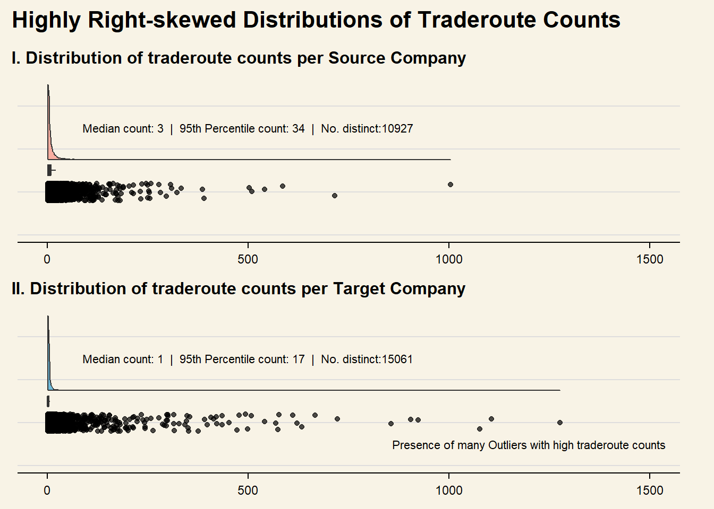{width=672}
:::
:::


::: {.focusbox .focus data-latex="focus"}
**Insights from Distribution of traderoute counts:**

The density raincloud plots of traderoute counts reveal the presence of outliers with values far above the median and 95th percentile value. This suggets that abnormal fishing activity could be investigated by filtering out traderoutes with very high frequency. **Investigating by using countries as filters, as well as companies beyond the top 95th percentile of traderoutes could thus give some insight into IUU fishing networks.**
:::

## 2.3: **Who are the Top players in the Trade Network by Tradecount?**

::: panel-tabset

## **Step 1: Filter links by Country and Yearly Frequency**


::: {.cell}

```{.r .cell-code  code-fold="false"}
links_sorted <- mc2_links_agg %>%
  # Only keep companies in suspicious countries
   filter(source %in% mc2_nodes_filtered$id |
           target %in% mc2_nodes_filtered$id) %>%
  
  # Group and calculate total number of tradecounts per year
  group_by(source, target, year) %>%
  summarise(weight = sum(weight)) %>%
  
  filter(source != target) %>%
  
  # Arrange data in order of year and descending order of tradecounts to get top
  arrange(year, desc(weight)) %>%
  ungroup()
  
# Filter out top 30 per year
top_30 <- links_sorted %>%
  group_by(year) %>%
  # Get top 30 companies by weight
  top_n(30, weight) %>%
  ungroup()
```
:::


## **Step 2: Ensure that id in nodes dataframe are = source and target in links dataframe**


::: {.cell}

```{.r .cell-code  code-fold="false"}
# Create nodes dataframe for top 10 exporters from oceanus
ttdistinct_source <- top_30 %>%
  distinct(source)

ttdistinct_target <- top_30 %>%
  distinct(target)

# Select only overlapping nodes and distinct companies from links
ttnodes_source <- inner_join(
    ttdistinct_source, mc2_nodes,
    by = c("source" = "id")) %>%
  mutate(id = source)

ttnodes_target <- inner_join(
    ttdistinct_target, mc2_nodes,
    by = c("target" = "id")) %>%
  mutate(id = target)

# Create new nodes data by combining filtered dataframes
top_30_nodes <- bind_rows(ttnodes_source, ttnodes_target) %>%
  select(id, uuid, shpcountry, rcvcountry) %>%
  distinct()
```
:::


## **Step 3: Create graph object**


::: {.cell}

```{.r .cell-code  code-fold="false"}
top_30_graph <- tbl_graph(nodes = top_30_nodes,
                          edges = top_30, 
                          directed = TRUE)
top_30_graph
```

::: {.cell-output .cell-output-stdout}
```
# A tbl_graph: 85 nodes and 211 edges
#
# A directed acyclic multigraph with 14 components
#
# A tibble: 85 × 4
  id                                     uuid shpcountry rcvcountry  
  <chr>                                 <int> <chr>      <chr>       
1 Coastal Cruisers Pic Shipping         24448 Marebak    Oceanus     
2 Marine Masterminds Dry dock           28774 Marebak    Coralmarica 
3 Mar y Luna Sagl                       28702 Marebak    Coralmarica 
4 Ianira Starfish Sagl Import           26454 Rio Isla   Sol y Oceana
5 Orange River   GmbH & Co. KG Shipping 30325 Marebak    Oceanus     
6 Olas del Sur Sea                      30295 Rio Isla   Coralmarica 
# ℹ 79 more rows
#
# A tibble: 211 × 4
   from    to year  weight
  <int> <int> <fct>  <int>
1     1    46 2028    5816
2     2    47 2028    5509
3     3    30 2028    4822
# ℹ 208 more rows
```
:::
:::

:::


::: {.cell}

```{.r .cell-code}
# Measure directed out-degree centrality and save as a column
V(top_30_graph)$out_degree <- degree(top_30_graph, mode = "out")

set.seed(1234)
ttg_out <- ggraph(top_30_graph, 
    layout = "kk"
  ) +
  geom_edge_link(
    aes(width = weight,
        color = year), 
    alpha = .6,
    arrow = arrow(length = unit(2, 'mm')),
    show.legend = FALSE
  ) +
  scale_edge_width(
    range = c(0.1, 4)
  ) +
  geom_node_point(
    color = "grey30",
    aes(size = out_degree)
  ) +
  geom_node_text(
    aes(label = ifelse(out_degree > quantile(out_degree, .75), uuid, "")), 
    size = 2,
    nudge_x = .5,
    nudge_y = -.2
  ) +
  guides(
    color = "none"
  ) +
  theme(
    plot.title = element_text(size = 20,
                              colour = "#3A3B60"),
    legend.position = "bottom",
    legend.direction = "horizontal",
    legend.title = element_text(),
    legend.box = "vertical",
    plot.background = element_rect(fill="#F8F3E6",colour="#F8F3E6"),
    plot.margin = margin(r = 15,
                         l = 15)
  ) +
  transition_states(year,
                    transition_length = 4,
                    state_length = 5
  ) +
  labs(
    title = 'Year: {closest_state}',
    subtitle = "Top Exporters by Degree Centrality >> \nLarger nodes represent higher out-degree Centrality, thicker links show higher frequency of trade"
  ) +
  enter_grow() +
  exit_fade()

ttg_out
```

::: {.cell-output-display}
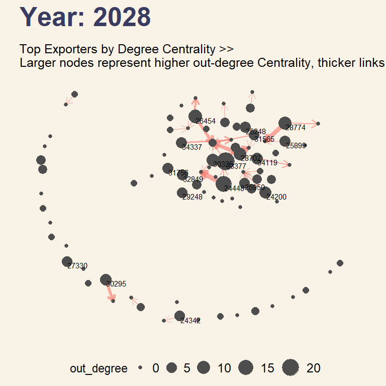
:::
:::


In the plot above, the relative sizes of the nodes are based on **Out-degree centrality**, where larger nodes have a higher number of out-going links. This enables us to visually determine companies with higher number of exporting links over time. Subsequent plots using **In-degree centrality** and **betweenness centrality** instead are shown below:


::: {.cell}

```{.r .cell-code}
# Measure directed out-degree centrality and save as a column
V(top_30_graph)$in_degree <- degree(top_30_graph, mode = "in")

set.seed(1234)
ttg_in <- ggraph(top_30_graph, 
    layout = "kk"
  ) +
  geom_edge_fan(
    aes(width = weight,
        color = year), 
    alpha = .6,
    arrow = arrow(length = unit(2, 'mm')),
    show.legend = FALSE
  ) +
  scale_edge_width(
    range = c(0.1, 4)
  ) +
  geom_node_point(
    color = "grey30",
    aes(size = in_degree)
  ) +
  geom_node_text(
    aes(label = ifelse(in_degree > quantile(in_degree, .75), uuid, "")), 
    size = 2,
    nudge_y = -.3
  ) +
  guides(
    color = "none"
  ) +
  theme(
    plot.title = element_text(size = 20,
                              colour = "#3A3B60"),
    legend.position = "bottom",
    legend.direction = "horizontal",
    legend.title = element_text(),
    legend.box = "vertical",
    plot.background = element_rect(fill="#F8F3E6",colour="#F8F3E6"),
    plot.margin = margin(r = 15,
                         l = 15)
  ) +
  transition_states(year,
                    transition_length = 3,
                    state_length = 2
  ) +
  labs(
    title = 'Year: {closest_state}',
    subtitle = "Expanding trade network through the years"
  ) +
  enter_grow() +
  exit_fade()

ttg_in
```

::: {.cell-output-display}
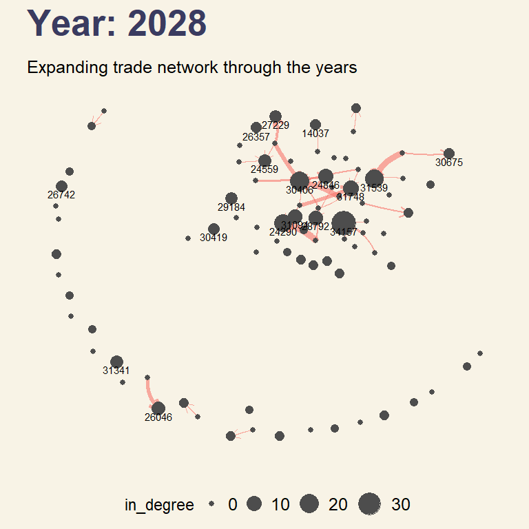
:::
:::

::: {.cell}

```{.r .cell-code}
# Calculate betweenness centrality and save values to new column
top_30_graph <- top_30_graph %>%
  mutate(betweenness = centrality_betweenness())

set.seed(1234)
ttg2 <- 
  ggraph(top_30_graph,
         layout = "kk"
  ) +
  geom_edge_link(
    aes(width = weight,
        color = year), 
        alpha = .6,
    arrow = arrow(length = unit(2, 'mm')),
    show.legend = FALSE
  ) +
  scale_edge_width(
    range = c(0.1, 4)
  ) +
  geom_node_point(
    color = "grey30",
    aes(size = betweenness)
  ) +
  geom_node_text(
  # Only show labels of top 75th percentile by betweenness centrality
    aes(label = ifelse(betweenness > quantile(betweenness, .75), uuid, "")),
    nudge_x = .7,
    size = 2
  ) +
  theme(
    plot.title = element_text(size = 20,
                              color = "#3A3B60"),
    legend.position = "bottom",
    legend.direction = "horizontal",
    legend.title = element_text(),
    plot.background = element_rect(fill="#F8F3E6",colour="#F8F3E6"),
    plot.margin = margin(r = 15,
                         l = 15)
  ) +
  transition_states(year,
                    transition_length = 3,
                    state_length = 2
  ) +
  labs(
    title = "Year: {closest_state}",
    subtitle = "Top Exporters by Betweenness Centrality >> \nLarger nodes represent higher out-degree Centrality, thicker links show higher frequency of trade"
  ) +
  enter_grow() +
  exit_fade()

ttg2
```

::: {.cell-output-display}
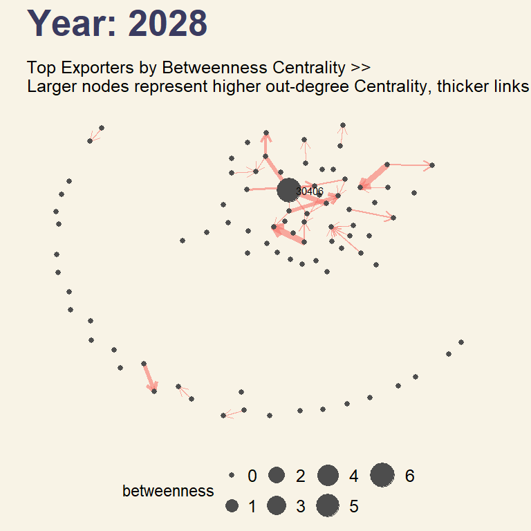
:::
:::

::: {.cell}

```{.r .cell-code}
# Calculate eigenvector centrality and save values to new column
ec <- eigen_centrality(top_30_graph)$vector
V(top_30_graph)$eigencentrality <- ec

set.seed(1234)
ttg3 <- 
  ggraph(top_30_graph,
         layout = "kk"
  ) +
  geom_edge_link(
    aes(width = weight,
        color = year), 
        alpha = .6,
    arrow = arrow(length = unit(2, 'mm')),
    show.legend = FALSE
  ) +
  scale_edge_width(
    range = c(0.1, 4)
  ) +
  geom_node_point(
    color = "grey30",
    aes(size = eigencentrality)
  ) +
  geom_node_text(
  # Only show labels of top 75th percentile by betweenness centrality
    aes(label = ifelse(eigencentrality > quantile(eigencentrality, .75), uuid, "")),
    nudge_x = .7,
    size = 2
  ) +
  theme(
    plot.title = element_text(size = 20,
                              color = "#3A3B60"),
    legend.position = "bottom",
    legend.direction = "horizontal",
    legend.title = element_text(),
    plot.background = element_rect(fill="#F8F3E6",colour="#F8F3E6"),
    plot.margin = margin(r = 15,
                         l = 15)
  ) +
  transition_states(year,
                    transition_length = 3,
                    state_length = 2
  ) +
  labs(
    title = "Year: {closest_state}",
    subtitle = "Company Network with Eigenvector Centrality >> \nLarger nodes represent higher Eigenvector Centrality, thicker links show higher frequency of trade"
  ) +
  enter_grow() +
  exit_fade()

ttg3
```

::: {.cell-output-display}
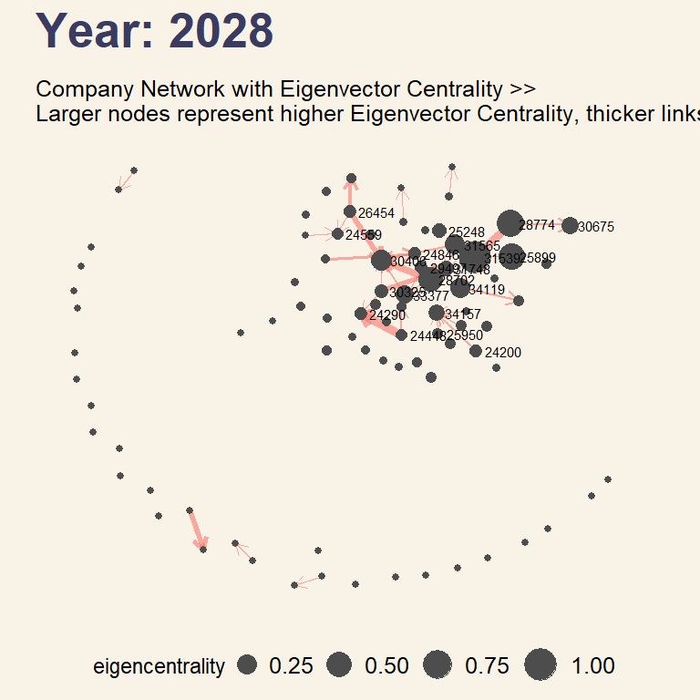
:::
:::

::: {.cell}

```{.r .cell-code}
# Calculate pageRank Score and save values to new column
pr <- page_rank(top_30_graph)$vector
V(top_30_graph)$pagerank <- pr

set.seed(1234)
ttg4 <- 
  ggraph(top_30_graph,
         layout = "kk"
  ) +
  geom_edge_link(
    aes(width = weight,
        color = year), 
        alpha = .6,
    arrow = arrow(length = unit(2, 'mm')),
    show.legend = FALSE
  ) +
  scale_edge_width(
    range = c(0.1, 4)
  ) +
  geom_node_point(
    color = "grey30",
    aes(size = pagerank)
  ) +
  geom_node_text(
  # Only show labels of top 75th percentile by betweenness centrality
    aes(label = ifelse(pagerank > quantile(pagerank, .75), uuid, "")),
    nudge_x = -.5,
    size = 2
  ) +
  theme(
    plot.title = element_text(size = 20,
                              color = "#3A3B60"),
    legend.position = "bottom",
    legend.direction = "horizontal",
    legend.title = element_text(),
    plot.background = element_rect(fill="#F8F3E6",colour="#F8F3E6"),
    plot.margin = margin(r = 15,
                         l = 15)
  ) +
  transition_states(year,
                    transition_length = 3,
                    state_length = 2
  ) +
  labs(
    title = "Year: {closest_state}",
    subtitle = "Company Network with PageRank Score >> \nLarger nodes represent higher Scores, thicker links show higher frequency of trade"
  ) +
  enter_grow() +
  exit_fade()

ttg4
```

::: {.cell-output-display}
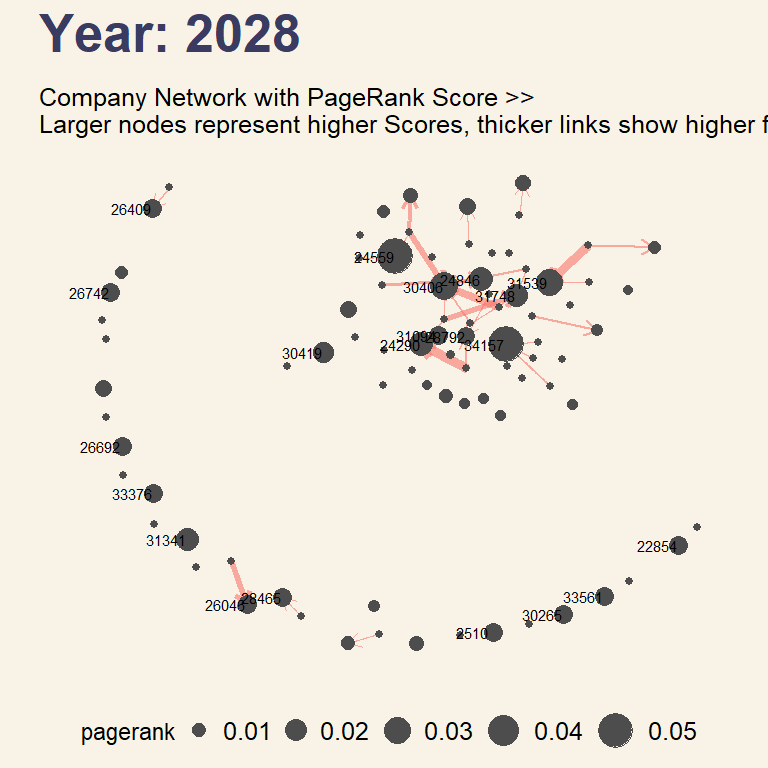
:::
:::


## 2.3.1 : Visualising distribution of Centrality Measures

Data Preparation:

::: panel-tabset

## Create dataframe with centrality measures


::: {.cell}

```{.r .cell-code  code-fold="false"}
# Retrieve Centrality measures from nodes
top30_centrality <- data.frame(
  company = V(top_30_graph)$id,
  uuid = V(top_30_graph)$uuid,
  OutDegree = V(top_30_graph)$out_degree,
  InDegree = V(top_30_graph)$in_degree,
  Betweenness_centrality = V(top_30_graph)$betweenness,
  Eigenvector_centrality = V(top_30_graph)$eigencentrality,
  PageRank_score = V(top_30_graph)$pagerank
)
```
:::


## Check that total degree of nodes = in + out degree


::: {.cell}

```{.r .cell-code  code-fold="false"}
all(degree(top_30_graph) == top30_centrality$OutDegree + top30_centrality$InDegree)
```

::: {.cell-output .cell-output-stdout}
```
[1] TRUE
```
:::
:::

:::


::: {.cell}

```{.r .cell-code}
ggplot(top30_centrality,
       aes(x = InDegree,
           y = OutDegree,
           label = uuid)
  ) +  
  geom_abline(intercept = 0, 
              slope = 1,
              color = "grey40",
              alpha = .6
  ) +
  ylim(0, 25) +
  xlim(0, 25) +
  geom_point(
    aes(color = ifelse(OutDegree == 0 & InDegree == 0, "grey40",
                       ifelse(OutDegree > 0 & InDegree <= 0,"#1696d2", "#fdbf11")
                       )
        ),
    show.legend = FALSE
  ) +
  geom_label_repel(aes(label = uuid),
                  box.padding = 0.35
  ) +
  annotate(
    geom = "text",
    x = 8,
    y = 20,
    label = "Net Exporters",
    size = 8,
    color = "grey70"
  ) +
  annotate(
    geom = "text",
    x = 20,
    y = 8,
    label = "Net Importers",
    size = 8,
    color = "grey70"
  ) +
  theme(plot.background = element_rect(fill="#F8F3E6",colour="#F8F3E6"))
```

::: {.cell-output-display}
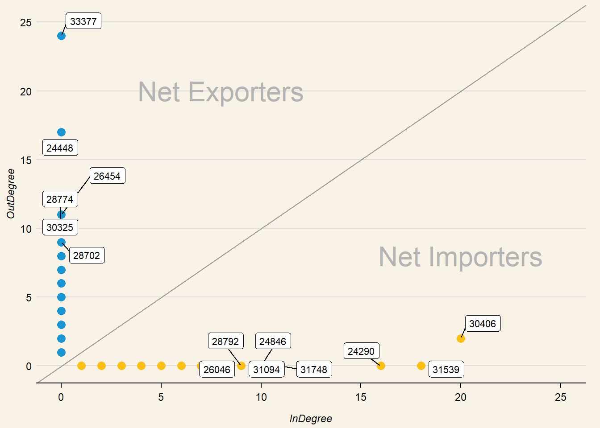{width=672}
:::
:::

::: {.cell}

```{.r .cell-code}
# Apply function to normalize values in dataframe
top30_centrality_scaled <- top30_centrality %>%
    select(OutDegree, InDegree, Betweenness_centrality, Eigenvector_centrality, PageRank_score)
    
top30_centrality_scaled <- transform_dataframe(top30_centrality_scaled)
```
:::

::: {.cell}

```{.r .cell-code}
# Density ridges to show distribution of data
inout_centrality <- top30_centrality_scaled %>%
  select(InDegree, OutDegree)

inout_centrality_long <- gather(inout_centrality, key = "CentralityMeasure", value = "CentralityScore")

ridge1 <- 

  ggplot(inout_centrality_long,
    aes(x = CentralityMeasure,
        y = CentralityScore, 
        fill = CentralityMeasure,
        color = CentralityMeasure)
  ) +
  geom_rain(
    alpha = .6
  ) +
  geom_rug() +
  annotate(
    geom = "text",
    x = 1.5,
    y = .5,
    label = "Presence of smaller peaks in distibution suggestive of outliers"
  ) +
  scale_fill_manual(
    values = c("#98cf90","salmon")
  ) +
  scale_color_manual(
    values = c("#98cf90","salmon")
  ) +
  labs(
    title = "I. Right-skewed Distributions of In and Out Degree Centrality",
    x = "Centrality Score",
    y = "Centrality Measure"
  ) +
  theme(
    legend.position = "none",
    axis.title = element_blank(),
    panel.grid.major = element_blank(),
    plot.background = element_rect(fill="#F8F3E6",colour="#F8F3E6")
  ) +
  coord_flip()

bep_centrality <- top30_centrality_scaled %>%
  select(Betweenness_centrality, Eigenvector_centrality, PageRank_score)

bep_centrality_long <- gather(bep_centrality, key = "CentralityMeasure", value = "CentralityScore")

ridge2 <- ggplot(
  bep_centrality_long,
    aes(x= CentralityMeasure,
        y = CentralityScore,
        fill = CentralityMeasure,
        color = CentralityMeasure)
  ) +
  geom_rain(
    alpha = .6
  ) +
  labs(
    title = "II. Highly skewed Distributions Indicate Potential Key Network Players",
    x = "Centrality Score",
    y = "Centrality Measure"
  ) +
  theme(
    legend.position = "none",
    axis.title = element_blank(),
    panel.grid.major = element_blank(),
    plot.background = element_rect(fill="#F8F3E6",colour="#F8F3E6")
  ) +
  coord_flip()

ridgepatch <- ridge1 / ridge2
ridgepatch & theme(plot.background = element_rect(fill="#F8F3E6",colour="#F8F3E6"))
```

::: {.cell-output-display}
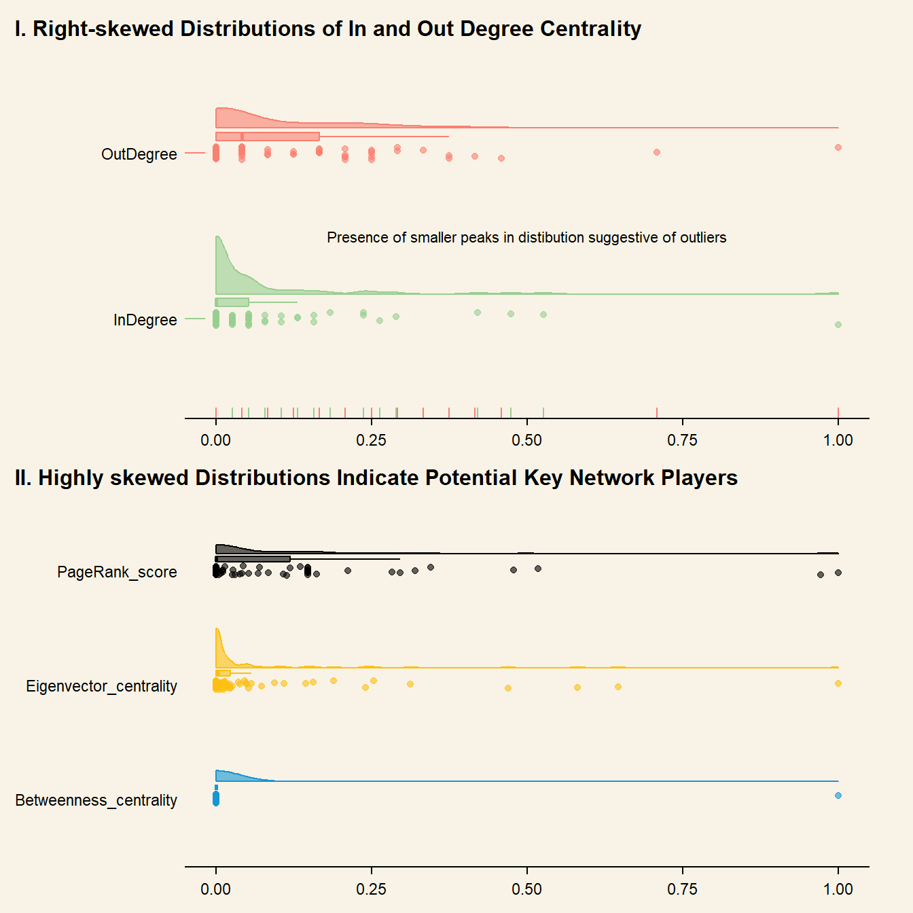{width=672}
:::
:::

\n


::: {.focusbox .focus data-latex="focus"}
**Insights from Network Graphs and Centrality Measure Distributions:**

  - From the network graphs, we can see that key nodes are unchanged for the entire time period (2028-2034), but heavier traderoutes (identified by thicker links) seem to vary from key nodes through the years. This could be indicative of IUU activity, with *fishy* trading partners. The distribution graphs show intensely skewed distributions of centrality measures. This enables us to classify companies based on their relative centrality in the network.  
  - Comparing the distribution of centrality measures, there are significantly more nodes with higher degree but lower betweenness centrality. This suggests that there are clusters of nodes in the network, and that these nodes are well-connected within their clusters but not to the rest of the nodes in other clusters. This could be indicative of various smaller IUU networks operating within the overall network.
  
:::


## 2.5: What are the most heavily traded products?

Using hscode (product code), we can filter the most frequently traded products by number of transactions, total export weight, as well as monetary value.


::: {.cell}

```{.r .cell-code}
hscode_links <- mc2_links %>%
  filter(source != target) %>%
  group_by(hscode, year) %>%
  summarise(
    weight = n(),
    weightkg = sum(weightkg),
    value_usd = sum(valueofgoodsusd)) %>%
  ungroup()

hscode_weight <- top_n(hscode_links, 10, weight) 

kbl(hscode_weight,
    caption = "Top Traded Products by Frequency") %>%
 kable_styling(
   bootstrap_options = "striped", 
   full_width = T,
   position = "float_left")
```

::: {.cell-output-display}
`````{=html}
<table class="table table-striped" style="float: left; margin-right: 10px;">
<caption>Top Traded Products by Frequency</caption>
 <thead>
  <tr>
   <th style="text-align:left;"> hscode </th>
   <th style="text-align:left;"> year </th>
   <th style="text-align:right;"> weight </th>
   <th style="text-align:right;"> weightkg </th>
   <th style="text-align:right;"> value_usd </th>
  </tr>
 </thead>
<tbody>
  <tr>
   <td style="text-align:left;"> 306170 </td>
   <td style="text-align:left;"> 2029 </td>
   <td style="text-align:right;"> 19933 </td>
   <td style="text-align:right;"> 368501755 </td>
   <td style="text-align:right;"> NA </td>
  </tr>
  <tr>
   <td style="text-align:left;"> 306170 </td>
   <td style="text-align:left;"> 2030 </td>
   <td style="text-align:right;"> 19740 </td>
   <td style="text-align:right;"> 362566380 </td>
   <td style="text-align:right;"> NA </td>
  </tr>
  <tr>
   <td style="text-align:left;"> 306170 </td>
   <td style="text-align:left;"> 2031 </td>
   <td style="text-align:right;"> 20826 </td>
   <td style="text-align:right;"> 391410125 </td>
   <td style="text-align:right;"> NA </td>
  </tr>
  <tr>
   <td style="text-align:left;"> 306170 </td>
   <td style="text-align:left;"> 2032 </td>
   <td style="text-align:right;"> 26242 </td>
   <td style="text-align:right;"> 504304550 </td>
   <td style="text-align:right;"> 5469832600 </td>
  </tr>
  <tr>
   <td style="text-align:left;"> 306170 </td>
   <td style="text-align:left;"> 2033 </td>
   <td style="text-align:right;"> 27125 </td>
   <td style="text-align:right;"> 521920430 </td>
   <td style="text-align:right;"> NA </td>
  </tr>
  <tr>
   <td style="text-align:left;"> 306170 </td>
   <td style="text-align:left;"> 2034 </td>
   <td style="text-align:right;"> 27046 </td>
   <td style="text-align:right;"> 523579660 </td>
   <td style="text-align:right;"> NA </td>
  </tr>
  <tr>
   <td style="text-align:left;"> 611020 </td>
   <td style="text-align:left;"> 2030 </td>
   <td style="text-align:right;"> 17454 </td>
   <td style="text-align:right;"> 102530790 </td>
   <td style="text-align:right;"> NA </td>
  </tr>
  <tr>
   <td style="text-align:left;"> 950300 </td>
   <td style="text-align:left;"> 2029 </td>
   <td style="text-align:right;"> 17756 </td>
   <td style="text-align:right;"> 157786485 </td>
   <td style="text-align:right;"> NA </td>
  </tr>
  <tr>
   <td style="text-align:left;"> 950300 </td>
   <td style="text-align:left;"> 2030 </td>
   <td style="text-align:right;"> 24609 </td>
   <td style="text-align:right;"> 219603135 </td>
   <td style="text-align:right;"> NA </td>
  </tr>
  <tr>
   <td style="text-align:left;"> 950300 </td>
   <td style="text-align:left;"> 2033 </td>
   <td style="text-align:right;"> 20281 </td>
   <td style="text-align:right;"> 170159030 </td>
   <td style="text-align:right;"> NA </td>
  </tr>
</tbody>
</table>

`````
:::
:::


Interestingly, the most frequently traded products for the data timerange are hscode **306170** across consecutive years.


::: {.cell}

```{.r .cell-code}
hscode_weightkg <- top_n(hscode_links, 10, weightkg) 

kbl(hscode_weightkg,
    caption = "Top Traded Products by Export Weight") %>%
 kable_styling(
   bootstrap_options = "striped", 
   full_width = T,
   position = "float_right")
```

::: {.cell-output-display}
`````{=html}
<table class="table table-striped" style="float: right; margin-left: 10px;">
<caption>Top Traded Products by Export Weight</caption>
 <thead>
  <tr>
   <th style="text-align:left;"> hscode </th>
   <th style="text-align:left;"> year </th>
   <th style="text-align:right;"> weight </th>
   <th style="text-align:right;"> weightkg </th>
   <th style="text-align:right;"> value_usd </th>
  </tr>
 </thead>
<tbody>
  <tr>
   <td style="text-align:left;"> 721049 </td>
   <td style="text-align:left;"> 2029 </td>
   <td style="text-align:right;"> 1019 </td>
   <td style="text-align:right;"> 2425597490 </td>
   <td style="text-align:right;"> NA </td>
  </tr>
  <tr>
   <td style="text-align:left;"> 721049 </td>
   <td style="text-align:left;"> 2030 </td>
   <td style="text-align:right;"> 1933 </td>
   <td style="text-align:right;"> 2681588855 </td>
   <td style="text-align:right;"> NA </td>
  </tr>
  <tr>
   <td style="text-align:left;"> 721049 </td>
   <td style="text-align:left;"> 2031 </td>
   <td style="text-align:right;"> 2009 </td>
   <td style="text-align:right;"> 2104841405 </td>
   <td style="text-align:right;"> NA </td>
  </tr>
  <tr>
   <td style="text-align:left;"> 721049 </td>
   <td style="text-align:left;"> 2032 </td>
   <td style="text-align:right;"> 1492 </td>
   <td style="text-align:right;"> 9454054095 </td>
   <td style="text-align:right;"> NA </td>
  </tr>
  <tr>
   <td style="text-align:left;"> 721049 </td>
   <td style="text-align:left;"> 2033 </td>
   <td style="text-align:right;"> 1897 </td>
   <td style="text-align:right;"> 5538412100 </td>
   <td style="text-align:right;"> NA </td>
  </tr>
  <tr>
   <td style="text-align:left;"> 721070 </td>
   <td style="text-align:left;"> 2030 </td>
   <td style="text-align:right;"> 966 </td>
   <td style="text-align:right;"> 2307116460 </td>
   <td style="text-align:right;"> 2396323455 </td>
  </tr>
  <tr>
   <td style="text-align:left;"> 870323 </td>
   <td style="text-align:left;"> 2029 </td>
   <td style="text-align:right;"> 9957 </td>
   <td style="text-align:right;"> 2103339585 </td>
   <td style="text-align:right;"> NA </td>
  </tr>
  <tr>
   <td style="text-align:left;"> 870323 </td>
   <td style="text-align:left;"> 2032 </td>
   <td style="text-align:right;"> 9137 </td>
   <td style="text-align:right;"> 2480119890 </td>
   <td style="text-align:right;"> NA </td>
  </tr>
  <tr>
   <td style="text-align:left;"> 870323 </td>
   <td style="text-align:left;"> 2033 </td>
   <td style="text-align:right;"> 8082 </td>
   <td style="text-align:right;"> 2475263755 </td>
   <td style="text-align:right;"> NA </td>
  </tr>
  <tr>
   <td style="text-align:left;"> 870323 </td>
   <td style="text-align:left;"> 2034 </td>
   <td style="text-align:right;"> 6858 </td>
   <td style="text-align:right;"> 2256084690 </td>
   <td style="text-align:right;"> NA </td>
  </tr>
</tbody>
</table>

`````
:::
:::

::: {.cell}

```{.r .cell-code}
hscode_value <- top_n(hscode_links, 10, value_usd) 

kbl(hscode_value,
    caption = "Top Traded Products by Monetary Value") %>%
 kable_styling(
   bootstrap_options = "striped", 
   full_width = T,
   position = "float_left")
```

::: {.cell-output-display}
`````{=html}
<table class="table table-striped" style="float: left; margin-right: 10px;">
<caption>Top Traded Products by Monetary Value</caption>
 <thead>
  <tr>
   <th style="text-align:left;"> hscode </th>
   <th style="text-align:left;"> year </th>
   <th style="text-align:right;"> weight </th>
   <th style="text-align:right;"> weightkg </th>
   <th style="text-align:right;"> value_usd </th>
  </tr>
 </thead>
<tbody>
  <tr>
   <td style="text-align:left;"> 292219 </td>
   <td style="text-align:left;"> 2028 </td>
   <td style="text-align:right;"> 43 </td>
   <td style="text-align:right;"> 2709850 </td>
   <td style="text-align:right;"> 62834348725 </td>
  </tr>
  <tr>
   <td style="text-align:left;"> 292219 </td>
   <td style="text-align:left;"> 2031 </td>
   <td style="text-align:right;"> 82 </td>
   <td style="text-align:right;"> 1352595 </td>
   <td style="text-align:right;"> 21239816860 </td>
  </tr>
  <tr>
   <td style="text-align:left;"> 293339 </td>
   <td style="text-align:left;"> 2034 </td>
   <td style="text-align:right;"> 51 </td>
   <td style="text-align:right;"> 16699830 </td>
   <td style="text-align:right;"> 224473283155 </td>
  </tr>
  <tr>
   <td style="text-align:left;"> 293359 </td>
   <td style="text-align:left;"> 2030 </td>
   <td style="text-align:right;"> 31 </td>
   <td style="text-align:right;"> 518205 </td>
   <td style="text-align:right;"> 84678321340 </td>
  </tr>
  <tr>
   <td style="text-align:left;"> 293359 </td>
   <td style="text-align:left;"> 2033 </td>
   <td style="text-align:right;"> 44 </td>
   <td style="text-align:right;"> 736045 </td>
   <td style="text-align:right;"> 49034437045 </td>
  </tr>
  <tr>
   <td style="text-align:left;"> 293399 </td>
   <td style="text-align:left;"> 2031 </td>
   <td style="text-align:right;"> 56 </td>
   <td style="text-align:right;"> 13151225 </td>
   <td style="text-align:right;"> 105112581320 </td>
  </tr>
  <tr>
   <td style="text-align:left;"> 293399 </td>
   <td style="text-align:left;"> 2032 </td>
   <td style="text-align:right;"> 53 </td>
   <td style="text-align:right;"> 14513980 </td>
   <td style="text-align:right;"> 226041275060 </td>
  </tr>
  <tr>
   <td style="text-align:left;"> 293410 </td>
   <td style="text-align:left;"> 2030 </td>
   <td style="text-align:right;"> 133 </td>
   <td style="text-align:right;"> 2526805 </td>
   <td style="text-align:right;"> 113052776765 </td>
  </tr>
  <tr>
   <td style="text-align:left;"> 293410 </td>
   <td style="text-align:left;"> 2031 </td>
   <td style="text-align:right;"> 93 </td>
   <td style="text-align:right;"> 1713555 </td>
   <td style="text-align:right;"> 35427144505 </td>
  </tr>
  <tr>
   <td style="text-align:left;"> 293410 </td>
   <td style="text-align:left;"> 2032 </td>
   <td style="text-align:right;"> 70 </td>
   <td style="text-align:right;"> 1462600 </td>
   <td style="text-align:right;"> 55075627030 </td>
  </tr>
</tbody>
</table>

`````
:::
:::


## 3: Categorizing  *fishy* companies

The network analysis metrics in section 2 are used to derive attributes of each *fishy* company, classifying them according to the following logic:

| Centrality Measure /<br>Node Category | **In Degree** | **Out Degree** | **Betweenness<br>Centrality** | **Eigenvector<br>Centrality** | **PageRank<br>Score** |
|---------------------------------------|:-------------:|----------------|:-----------------------------:|:-----------------------------:|:---------------------:|
| **Central Broker**                    | -             | -              | High                          | High                          | High                  |
| **Key Importer**                      | High          | Low            | -                             | -                             | High                  |
| **Key Exporter**                      | Low           | High           | High                          |                               |                       |
| **Cluster Broker**                    | High          |                | Low                           | Low                           | -                     |
| **NetImporter**                       | High          | Low            | Low                           | Low                           | Low                   |
| **NetExporter**                       | Low           | High         | Low                           | Low                           | Low                   |


## **Net Exporters or Importers?**


::: {.cell}

```{.r .cell-code}
top30_centrality$netDegree <- ifelse(top30_centrality$OutDegree == 0 & top30_centrality$InDegree == 0, "neutral",
                       ifelse(top30_centrality$OutDegree > 0 & top30_centrality$InDegree <= 0,"netExporter", "netImporter"))
```
:::


##  **Fishy Network**

Labels are assigned to the companies Centrality Measures: 


::: {.cell}

```{.r .cell-code  code-fold="false"}
top30_centrality <- top30_centrality %>%
  mutate(
    group = ifelse(Betweenness_centrality >0 & 
                  Eigenvector_centrality > quantile(Eigenvector_centrality, .75) &
                  PageRank_score > quantile(PageRank_score, .75), "centralBroker",
            ifelse(netDegree == "netImporter" & 
                  PageRank_score > quantile(PageRank_score, .75), "keyImporter",
            ifelse(netDegree == "netExmporter" &
                   Betweenness_centrality > quantile(Betweenness_centrality, .75), "keyExporter", 
            ifelse((InDegree > quantile(InDegree, .75) | 
                     OutDegree > quantile(OutDegree, .75)) &
                  (Betweenness_centrality < quantile(Betweenness_centrality, .5)|
                  Eigenvector_centrality < quantile(Eigenvector_centrality, .5)), "clusterBroker",
            ifelse(netDegree == "netImporter", "netImporter", "netExporter"))))))
```
:::

::: {.cell}

```{.r .cell-code}
# Combine edges and nodes to a graph dataframe
vis_links <- top_30 %>% 
  rename(
    "from" = "source", 
    "to" = "target") %>%
  select(from, to, year, weight)
```
:::

::: {.cell}

```{.r .cell-code}
vis_nodes <- top30_centrality %>%
  rename("id" = "company")
```
:::

::: {.cell}

```{.r .cell-code}
visNetwork(vis_nodes, vis_links,
          height = "500px", width = "100%") %>%
  visIgraphLayout(layout = "layout_with_kk") %>%
  visGroups(groupname = "centralBroker", shape = "icon", 
            icon = list(code = "f714")) %>%
  addFontAwesome() %>%
  visLegend() %>%
  visEdges(value = "weight",
           scaling = list(min = 10, max = 50),
           arrows = "to") %>%
  visOptions(highlightNearest = list(enabled = T, degree = 2, hover = T),
             nodesIdSelection = TRUE,
             selectedBy = "group",
             collapse = TRUE)
```

::: {.cell-output-display}
```{=html}
<div id="htmlwidget-d1b0139461bdf3adcc41" style="width:100%;height:500px;" class="visNetwork html-widget "></div>
<script type="application/json" data-for="htmlwidget-d1b0139461bdf3adcc41">{"x":{"nodes":{"id":["Coastal Cruisers Pic Shipping","Marine Masterminds Dry dock","Mar y Luna Sagl","Ianira Starfish Sagl Import","Orange River   GmbH & Co. KG Shipping","Olas del Sur Sea","nián yú Ltd. Corporation","Saltwater Symphony S.A. de C.V.","Uttar Pradesh s CJSC","bǐ mù yú Sagl Distribution","Caracola del Este Corporation Express","Fresh Limited Liability Company","Blue Nile  N.V. Marine","Playa del Tesoro BV","Fisherman's Bounty AG Solutions","Náutica del Norte Kga Holdings","French Crab S.p.A. Worldwide","Chhattisgarh   Marine ecology A/S Delivery","Mar del Este Sp","Isla del Mar Marine Oyj Transit","Makumba Ltd. Liability Co","Ola Azul Ges.m.b.H. Services","Dry Creek Pic Marine biology","suō yú Incorporated Brothers","Nile   S.A. de C.V.","Tamil Nadu  Market Co","Lake Kainji  S.p.A. Export","Mar de la Vida Krill","Sea Breezes S.A. de C.V. Freight ","Panope Limited Liability Company","Icelandic Cod Pier ОАО Transport","Haryana Sea  Mussel Inc Export","Danish Shrimp Kga Solutions","Aqua Mermaid Corporation Export","Himachal Pradesh   S.A. de C.V. America","Selous Game Reserve  Sp Distribution","Maharashtra   Limited Liability Company","Seashell s  SRL Industrial","Paradera S.A. de C.V.","Oceanfront Oasis Barracuda ОАО Shipping","Saltwater Sisters Inc Seafaring","Beachcombers NV and Son's","Mar de la Luna Ltd. Corporation","Estrella de la Costa SRL","West Bengal  A/S Freight ","Caracola del Sol Services","Saltwater Supreme ОАО Forwading","Sea Breezes GmbH & Co. KG Shark","Greek Sea Bass LLC","Kong zhong diao yu  Express Charter Boat ","Costa de la Felicidad Shipping","Playa de la Luna Incorporated","-1203","Marine Mates Cruise ship","hǎi dǎn Corporation Wharf","-2821","Coastal Castaway Coast Corporation Worldwide","Playa del Mar Anchor N.V. Services","Coral Cove BV Delivery","Himachal Pradesh   Plc International","Mar del Este CJSC","ReefRider Foods Ltd. Corporation Family","Sailors and Surfers Incorporated Enterprises","Niger Bend   Limited Liability Company Marine ecology","Black Sea Tuna Sagl","Uttar Pradesh s Barracuda","Haryana s Sagl Transport","Olas del Mar Worldwide","-1225","Isla del Tesoro GmbH & Co. KG Chart","Bihar   CJSC & Son's","Maharashtra ers Corporation Industrial","Harbah Ltd. Liability Co Consultants","Mar de la Luz A/S","bǐ mù yú Ltd. Corporation","Pao gan SE Seal","Togo  S.A. de C.V.","-2105","Isla del Este SE","Brisa del Mar LC","Océano de Coral Corporation Express","Meghalaya  Marine GmbH & Co. KG Import","Volga River LLC Enterprises","-2119","Arunachal Pradesh s Brine"],"uuid":[24448,28774,28702,26454,30325,30295,34337,31565,33377,34119,24200,25950,23829,30815,25828,29497,25899,24342,28489,26715,27881,30121,25248,34441,29248,32849,27330,28392,31756,30406,26477,26328,25002,22582,26411,32314,27837,32198,30428,29823,31461,23542,28322,25493,33720,24290,31539,31748,26046,27229,24846,30675,2266,28792,34157,14037,24409,30743,24559,26409,28465,31094,31341,29184,23775,33376,26357,30265,2510,26742,23672,27870,26298,28341,34107,30419,33189,12288,26692,23989,29990,28952,33561,12443,22854],"OutDegree":[17,10,9,11,9,7,6,5,24,7,8,5,4,4,3,4,6,5,1,1,1,2,6,4,5,6,5,1,6,2,4,1,2,1,4,2,3,1,1,1,3,1,1,1,1,0,0,0,0,0,0,0,0,0,0,0,0,0,0,0,0,0,0,0,0,0,0,0,0,0,0,0,0,0,0,0,0,0,0,0,0,0,0,0,0],"InDegree":[0,0,0,0,0,0,0,0,0,0,0,0,0,0,0,0,0,0,0,0,0,0,0,0,0,0,0,0,0,20,0,0,0,0,0,0,0,0,0,0,0,0,0,0,0,16,18,11,7,5,10,3,2,9,38,3,2,2,6,1,2,9,6,5,2,1,3,2,1,4,1,2,1,2,1,4,2,1,1,2,2,1,1,1,1],"Betweenness_centrality":[0,0,0,0,0,0,0,0,0,0,0,0,0,0,0,0,0,0,0,0,0,0,0,0,0,0,0,0,0,6,0,0,0,0,0,0,0,0,0,0,0,0,0,0,0,0,0,0,0,0,0,0,0,0,0,0,0,0,0,0,0,0,0,0,0,0,0,0,0,0,0,0,0,0,0,0,0,0,0,0,0,0,0,0,0],"Eigenvector_centrality":[0.0386029448104839,0.646549698151311,0.47015618273072,0.0534349113476937,0.073198377285977,2.81071523263322e-17,0.0064221541679053,0.241052250851856,0.189445186417006,0.253753080590356,0.0488868243244947,0.0266861207390308,0.0190328791183926,0.00161194835106318,0.00273320609140939,0.0577635655474443,0.580948248156619,5.13225170031304e-17,0.0043047430326475,1.0225176674352e-17,0.00102257699415957,2.49830360079113e-17,0.0946743095130973,0.0032251396359064,0.0127297874560181,0.00574926269461455,5.33906725301754e-17,0.0114663661988555,0.00513472317447694,0.31248676492332,0.0227954216927295,1.21675137788217e-17,2.45740247088898e-17,1.32013601909448e-17,4.8701518590255e-17,0.00351190668463757,0.0190591676254622,0.0038805101465814,1.83276976543908e-05,0.00118193964260002,8.79795201861738e-17,1.35635328243546e-17,4.91939750160093e-18,1.09305646077918e-17,1.14715177109504e-17,0.0459819104364697,1,0.109700515062701,6.94411998650561e-18,0.0148563509818848,0.0496401191601421,0.157034644224505,0.0231740206648627,0.0137743637794587,0.144359973583201,0.000219936344834936,0.000199277589306802,1.73063719511158e-17,0.0364633165520162,1.06790713274388e-17,2.4061751453093e-17,0.019314118287675,6.98855408760974e-17,0.00163151602902884,0.00129804195391615,1.13457274336979e-17,0.00663269051123447,2.56206913943617e-17,1.08249541130456e-17,4.1302401158577e-17,1.1045060963295e-17,0.0233081827917461,0.00957338867672088,2.89893759034869e-17,0.00737409668342015,0.000536411496739831,3.64785886419094e-17,2.33388824360448e-17,1.33498606295342e-17,0.00385054276706742,0.0147186576126893,0.0184079668653375,1.03435817214062e-17,0.00126860325118239,8.06776342013905e-18],"PageRank_score":[0.00795052037285831,0.00795052037285831,0.00795052037285831,0.00795052037285831,0.00795052037285831,0.00795052037285831,0.00795052037285831,0.00795052037285831,0.00795052037285831,0.00795052037285831,0.00795052037285831,0.00795052037285831,0.00795052037285831,0.00795052037285831,0.00795052037285831,0.00795052037285831,0.00795052037285831,0.00795052037285831,0.00795052037285831,0.00795052037285831,0.00795052037285831,0.00795052037285831,0.00795052037285831,0.00795052037285831,0.00795052037285831,0.00795052037285831,0.00795052037285831,0.00795052037285831,0.00795052037285831,0.0315956545436974,0.00795052037285831,0.00795052037285831,0.00795052037285831,0.00795052037285831,0.00795052037285831,0.00795052037285831,0.00795052037285831,0.00795052037285831,0.00795052037285831,0.00795052037285831,0.00795052037285831,0.00795052037285831,0.00795052037285831,0.00795052037285831,0.00795052037285831,0.0237088854477863,0.029808072094857,0.0208872263436773,0.0147084626897879,0.0111746720645492,0.0225742957008216,0.00987862467045814,0.0092180097177006,0.0141434636453179,0.0536504359312723,0.0134288955754112,0.0118096198988211,0.0103551980898175,0.0523468300378747,0.0147084626897879,0.0147084626897879,0.0153478450434132,0.0214664050067174,0.0131451194004751,0.00998648048057071,0.0147084626897879,0.00938995865473077,0.0147084626897879,0.0147084626897879,0.0147084626897879,0.00919094236260199,0.00849357110318159,0.00817356803637685,0.011063362983085,0.00812232735691988,0.0176353719472336,0.0129354393838491,0.0097235436787971,0.0147084626897879,0.00861860012814382,0.00848786305324793,0.00830038111762051,0.0147084626897879,0.00843181319732884,0.0147084626897879],"netDegree":["netExporter","netExporter","netExporter","netExporter","netExporter","netExporter","netExporter","netExporter","netExporter","netExporter","netExporter","netExporter","netExporter","netExporter","netExporter","netExporter","netExporter","netExporter","netExporter","netExporter","netExporter","netExporter","netExporter","netExporter","netExporter","netExporter","netExporter","netExporter","netExporter","netImporter","netExporter","netExporter","netExporter","netExporter","netExporter","netExporter","netExporter","netExporter","netExporter","netExporter","netExporter","netExporter","netExporter","netExporter","netExporter","netImporter","netImporter","netImporter","netImporter","netImporter","netImporter","netImporter","netImporter","netImporter","netImporter","netImporter","netImporter","netImporter","netImporter","netImporter","netImporter","netImporter","netImporter","netImporter","netImporter","netImporter","netImporter","netImporter","netImporter","netImporter","netImporter","netImporter","netImporter","netImporter","netImporter","netImporter","netImporter","netImporter","netImporter","netImporter","netImporter","netImporter","netImporter","netImporter","netImporter"],"group":["netExporter","netExporter","netExporter","netExporter","netExporter","clusterBroker","netExporter","netExporter","netExporter","netExporter","netExporter","netExporter","netExporter","netExporter","netExporter","netExporter","netExporter","clusterBroker","netExporter","netExporter","netExporter","netExporter","netExporter","netExporter","netExporter","netExporter","clusterBroker","netExporter","netExporter","centralBroker","netExporter","netExporter","netExporter","netExporter","netExporter","netExporter","netExporter","netExporter","netExporter","netExporter","netExporter","netExporter","netExporter","netExporter","netExporter","keyImporter","keyImporter","keyImporter","keyImporter","netImporter","keyImporter","netImporter","netImporter","keyImporter","keyImporter","clusterBroker","netImporter","netImporter","keyImporter","keyImporter","keyImporter","keyImporter","keyImporter","clusterBroker","netImporter","keyImporter","netImporter","keyImporter","keyImporter","keyImporter","netImporter","netImporter","netImporter","netImporter","netImporter","keyImporter","netImporter","netImporter","keyImporter","netImporter","netImporter","netImporter","keyImporter","netImporter","keyImporter"],"x":[0.123951254405944,0.474581654788399,0.257701068644635,-0.0628616271868783,0.130049534420675,0.70613090409108,0.235458883043377,0.19142862527129,0.127934523997643,0.375519195395955,0.471454382200988,0.395466086773605,0.434133063949579,0.468575624628097,0.352994398184106,0.16563234258387,0.376587545100203,-0.0968180128187409,0.357440818746456,-0.549512459670207,0.109055704082206,-0.973269419054022,-0.0557970947892934,-0.116928385460918,-0.161050334737123,-0.220797937801409,-0.900299022335231,0.0157236834119241,-0.0248762104792084,0.0918212870855941,0.429102706807559,-0.998870814152373,-0.336869974523934,-0.844831000959604,0.48388708342994,0.391087772393851,0.343384476531535,-0.146726955035046,-0.251235733878709,-0.00265842187367016,0.270689687301644,-0.748482466887458,-0.819848722999367,-0.959742559557332,1,0.00614478725216894,0.327880586110731,0.0666424520023687,0.804798786260308,-0.229591408861832,0.283194204941319,0.614209124291284,0.565111448990099,0.0292730513236354,0.280160700312157,0.609393486819671,0.451388690411948,-0.226264782689169,0.0779252604061365,-0.594022682179454,-0.984113343076893,-0.0315902764542614,-0.904723060090917,0.120469231886329,-0.0176737048141354,-1,-0.159365339023804,-0.440867612889032,-0.903412890504192,0.595415545414637,-0.104053274955695,-0.0365956835313397,0.0189540066964631,0.0295118137785126,0.081686209945917,-0.139279660898849,0.148684552970121,0.37860700916858,-0.709944408946049,0.155496529874092,0.15848792238366,0.434953623704483,-0.985881626710768,0.636098359142337,0.927342376202887],"y":[0.311117849984143,0.769466112682971,0.537611734779745,0.748873156543478,0.47514742911069,-0.712818065626884,0.100644887482388,0.742851169184109,0.406809046880135,0.489611951449533,0.36250891587837,0.31772467808379,0.429402240620183,0.239746323986739,0.113163063890181,0.685638798300824,0.856663356599862,-0.967007215047288,0.584742828964495,-0.7972577691972,0.960350700702783,-0.121785652330584,0.652378397671118,0.353103006819214,0.202325324057973,0.32871602108289,-0.207918910755375,0.755534426714106,0.0595172167280495,0.623000146321944,0.533925339801541,0.140461390214402,-0.882963814343404,0.863774376566715,-0.862706242331049,0.186960793274211,0.254982158765619,0.591579032412352,-0.154104338636312,0.944310126537784,-0.95723115570779,-0.521617394461672,-0.448456579422979,0.559932454399982,-0.345535869151122,0.268713723312307,0.692966230691174,0.570401373757631,-0.620356888875381,0.772666015766953,0.313297544413194,0.826238206818571,0.51718703714395,0.497284385321439,0.419924894858085,0.143567037622936,-0.0351395732291763,-0.984945615127428,0.79405810080401,-0.665666813527294,0.0180421053552577,0.335997112179345,-0.346304969304923,-0.0446987892370212,0.175583680304219,0.280785332512205,0.884796642634785,-0.806468314019564,0.73458043447465,-0.794940805705616,-0.824233163331489,0.449976489219509,0.402717576861578,-1,0.247847109372397,-0.0564732357271486,-0.93356305902007,-0.887761613604554,-0.656241342504345,0.0898257818057713,0.249475670183714,1,0.421068998259236,0.331217139745051,-0.468367651256895],"label":["Coastal Cruisers Pic Shipping","Marine Masterminds Dry dock","Mar y Luna Sagl","Ianira Starfish Sagl Import","Orange River   GmbH & Co. KG Shipping","Olas del Sur Sea","nián yú Ltd. Corporation","Saltwater Symphony S.A. de C.V.","Uttar Pradesh s CJSC","bǐ mù yú Sagl Distribution","Caracola del Este Corporation Express","Fresh Limited Liability Company","Blue Nile  N.V. Marine","Playa del Tesoro BV","Fisherman's Bounty AG Solutions","Náutica del Norte Kga Holdings","French Crab S.p.A. Worldwide","Chhattisgarh   Marine ecology A/S Delivery","Mar del Este Sp","Isla del Mar Marine Oyj Transit","Makumba Ltd. Liability Co","Ola Azul Ges.m.b.H. Services","Dry Creek Pic Marine biology","suō yú Incorporated Brothers","Nile   S.A. de C.V.","Tamil Nadu  Market Co","Lake Kainji  S.p.A. Export","Mar de la Vida Krill","Sea Breezes S.A. de C.V. Freight ","Panope Limited Liability Company","Icelandic Cod Pier ОАО Transport","Haryana Sea  Mussel Inc Export","Danish Shrimp Kga Solutions","Aqua Mermaid Corporation Export","Himachal Pradesh   S.A. de C.V. America","Selous Game Reserve  Sp Distribution","Maharashtra   Limited Liability Company","Seashell s  SRL Industrial","Paradera S.A. de C.V.","Oceanfront Oasis Barracuda ОАО Shipping","Saltwater Sisters Inc Seafaring","Beachcombers NV and Son's","Mar de la Luna Ltd. Corporation","Estrella de la Costa SRL","West Bengal  A/S Freight ","Caracola del Sol Services","Saltwater Supreme ОАО Forwading","Sea Breezes GmbH & Co. KG Shark","Greek Sea Bass LLC","Kong zhong diao yu  Express Charter Boat ","Costa de la Felicidad Shipping","Playa de la Luna Incorporated","-1203","Marine Mates Cruise ship","hǎi dǎn Corporation Wharf","-2821","Coastal Castaway Coast Corporation Worldwide","Playa del Mar Anchor N.V. Services","Coral Cove BV Delivery","Himachal Pradesh   Plc International","Mar del Este CJSC","ReefRider Foods Ltd. Corporation Family","Sailors and Surfers Incorporated Enterprises","Niger Bend   Limited Liability Company Marine ecology","Black Sea Tuna Sagl","Uttar Pradesh s Barracuda","Haryana s Sagl Transport","Olas del Mar Worldwide","-1225","Isla del Tesoro GmbH & Co. KG Chart","Bihar   CJSC & Son's","Maharashtra ers Corporation Industrial","Harbah Ltd. Liability Co Consultants","Mar de la Luz A/S","bǐ mù yú Ltd. Corporation","Pao gan SE Seal","Togo  S.A. de C.V.","-2105","Isla del Este SE","Brisa del Mar LC","Océano de Coral Corporation Express","Meghalaya  Marine GmbH & Co. KG Import","Volga River LLC Enterprises","-2119","Arunachal Pradesh s Brine"]},"edges":{"from":["Coastal Cruisers Pic Shipping","Marine Masterminds Dry dock","Mar y Luna Sagl","Ianira Starfish Sagl Import","Orange River   GmbH & Co. KG Shipping","Olas del Sur Sea","Ianira Starfish Sagl Import","nián yú Ltd. Corporation","Saltwater Symphony S.A. de C.V.","Marine Masterminds Dry dock","Uttar Pradesh s CJSC","bǐ mù yú Sagl Distribution","Coastal Cruisers Pic Shipping","Caracola del Este Corporation Express","Fresh Limited Liability Company","Uttar Pradesh s CJSC","Blue Nile  N.V. Marine","Orange River   GmbH & Co. KG Shipping","Playa del Tesoro BV","Fisherman's Bounty AG Solutions","Náutica del Norte Kga Holdings","French Crab S.p.A. Worldwide","Chhattisgarh   Marine ecology A/S Delivery","Saltwater Symphony S.A. de C.V.","Mar del Este Sp","Orange River   GmbH & Co. KG Shipping","Ianira Starfish Sagl Import","Isla del Mar Marine Oyj Transit","Makumba Ltd. Liability Co","Ola Azul Ges.m.b.H. Services","Coastal Cruisers Pic Shipping","Mar y Luna Sagl","Marine Masterminds Dry dock","Marine Masterminds Dry dock","Orange River   GmbH & Co. KG Shipping","Orange River   GmbH & Co. KG Shipping","Uttar Pradesh s CJSC","Olas del Sur Sea","Playa del Tesoro BV","Dry Creek Pic Marine biology","nián yú Ltd. Corporation","Ianira Starfish Sagl Import","Uttar Pradesh s CJSC","Fisherman's Bounty AG Solutions","Ianira Starfish Sagl Import","Fresh Limited Liability Company","Caracola del Este Corporation Express","Orange River   GmbH & Co. KG Shipping","suō yú Incorporated Brothers","Uttar Pradesh s CJSC","bǐ mù yú Sagl Distribution","Mar y Luna Sagl","Nile   S.A. de C.V.","Fisherman's Bounty AG Solutions","Coastal Cruisers Pic Shipping","French Crab S.p.A. Worldwide","Tamil Nadu  Market Co","Lake Kainji  S.p.A. Export","Mar de la Vida Krill","Ola Azul Ges.m.b.H. Services","bǐ mù yú Sagl Distribution","Coastal Cruisers Pic Shipping","Uttar Pradesh s CJSC","Marine Masterminds Dry dock","Saltwater Symphony S.A. de C.V.","Mar y Luna Sagl","Uttar Pradesh s CJSC","Tamil Nadu  Market Co","Marine Masterminds Dry dock","nián yú Ltd. Corporation","Dry Creek Pic Marine biology","French Crab S.p.A. Worldwide","Nile   S.A. de C.V.","Olas del Sur Sea","suō yú Incorporated Brothers","Sea Breezes S.A. de C.V. Freight ","Uttar Pradesh s CJSC","Uttar Pradesh s CJSC","Ianira Starfish Sagl Import","Uttar Pradesh s CJSC","Coastal Cruisers Pic Shipping","Panope Limited Liability Company","Caracola del Este Corporation Express","bǐ mù yú Sagl Distribution","Icelandic Cod Pier ОАО Transport","suō yú Incorporated Brothers","Fresh Limited Liability Company","Playa del Tesoro BV","bǐ mù yú Sagl Distribution","Haryana Sea  Mussel Inc Export","Uttar Pradesh s CJSC","nián yú Ltd. Corporation","Olas del Sur Sea","Dry Creek Pic Marine biology","Ianira Starfish Sagl Import","Coastal Cruisers Pic Shipping","Sea Breezes S.A. de C.V. Freight ","Uttar Pradesh s CJSC","bǐ mù yú Sagl Distribution","Coastal Cruisers Pic Shipping","Tamil Nadu  Market Co","Caracola del Este Corporation Express","Náutica del Norte Kga Holdings","Nile   S.A. de C.V.","suō yú Incorporated Brothers","Marine Masterminds Dry dock","Panope Limited Liability Company","Dry Creek Pic Marine biology","Mar y Luna Sagl","Orange River   GmbH & Co. KG Shipping","Icelandic Cod Pier ОАО Transport","Danish Shrimp Kga Solutions","Lake Kainji  S.p.A. Export","Fresh Limited Liability Company","Mar y Luna Sagl","Blue Nile  N.V. Marine","Aqua Mermaid Corporation Export","Himachal Pradesh   S.A. de C.V. America","Mar y Luna Sagl","Chhattisgarh   Marine ecology A/S Delivery","Uttar Pradesh s CJSC","Náutica del Norte Kga Holdings","Uttar Pradesh s CJSC","Dry Creek Pic Marine biology","Olas del Sur Sea","Uttar Pradesh s CJSC","Ianira Starfish Sagl Import","Lake Kainji  S.p.A. Export","Uttar Pradesh s CJSC","Caracola del Este Corporation Express","Tamil Nadu  Market Co","nián yú Ltd. Corporation","Uttar Pradesh s CJSC","Marine Masterminds Dry dock","Coastal Cruisers Pic Shipping","Himachal Pradesh   S.A. de C.V. America","Uttar Pradesh s CJSC","Chhattisgarh   Marine ecology A/S Delivery","Selous Game Reserve  Sp Distribution","Coastal Cruisers Pic Shipping","Maharashtra   Limited Liability Company","Uttar Pradesh s CJSC","bǐ mù yú Sagl Distribution","Seashell s  SRL Industrial","Danish Shrimp Kga Solutions","Paradera S.A. de C.V.","Sea Breezes S.A. de C.V. Freight ","Icelandic Cod Pier ОАО Transport","Oceanfront Oasis Barracuda ОАО Shipping","Dry Creek Pic Marine biology","Mar y Luna Sagl","French Crab S.p.A. Worldwide","Saltwater Symphony S.A. de C.V.","Saltwater Sisters Inc Seafaring","Olas del Sur Sea","Saltwater Sisters Inc Seafaring","Marine Masterminds Dry dock","Lake Kainji  S.p.A. Export","Nile   S.A. de C.V.","Uttar Pradesh s CJSC","Caracola del Este Corporation Express","Icelandic Cod Pier ОАО Transport","Uttar Pradesh s CJSC","Himachal Pradesh   S.A. de C.V. America","Orange River   GmbH & Co. KG Shipping","Sea Breezes S.A. de C.V. Freight ","Maharashtra   Limited Liability Company","Tamil Nadu  Market Co","Beachcombers NV and Son's","Chhattisgarh   Marine ecology A/S Delivery","nián yú Ltd. Corporation","Ianira Starfish Sagl Import","Coastal Cruisers Pic Shipping","Coastal Cruisers Pic Shipping","Ianira Starfish Sagl Import","Chhattisgarh   Marine ecology A/S Delivery","Blue Nile  N.V. Marine","Selous Game Reserve  Sp Distribution","Uttar Pradesh s CJSC","Coastal Cruisers Pic Shipping","French Crab S.p.A. Worldwide","Marine Masterminds Dry dock","Olas del Sur Sea","Uttar Pradesh s CJSC","Coastal Cruisers Pic Shipping","Nile   S.A. de C.V.","Saltwater Sisters Inc Seafaring","Uttar Pradesh s CJSC","Himachal Pradesh   S.A. de C.V. America","Orange River   GmbH & Co. KG Shipping","Maharashtra   Limited Liability Company","Tamil Nadu  Market Co","Caracola del Este Corporation Express","Lake Kainji  S.p.A. Export","Mar y Luna Sagl","Coastal Cruisers Pic Shipping","Náutica del Norte Kga Holdings","Coastal Cruisers Pic Shipping","Mar de la Luna Ltd. Corporation","Playa del Tesoro BV","French Crab S.p.A. Worldwide","Blue Nile  N.V. Marine","Coastal Cruisers Pic Shipping","Sea Breezes S.A. de C.V. Freight ","Ianira Starfish Sagl Import","Fresh Limited Liability Company","Estrella de la Costa SRL","Saltwater Symphony S.A. de C.V.","Sea Breezes S.A. de C.V. Freight ","Caracola del Este Corporation Express","West Bengal  A/S Freight "],"to":["Caracola del Sol Services","Saltwater Supreme ОАО Forwading","Panope Limited Liability Company","Panope Limited Liability Company","Sea Breezes GmbH & Co. KG Shark","Greek Sea Bass LLC","Kong zhong diao yu  Express Charter Boat ","Costa de la Felicidad Shipping","Panope Limited Liability Company","Playa de la Luna Incorporated","Panope Limited Liability Company","-1203","Marine Mates Cruise ship","hǎi dǎn Corporation Wharf","hǎi dǎn Corporation Wharf","Sea Breezes GmbH & Co. KG Shark","hǎi dǎn Corporation Wharf","Panope Limited Liability Company","-2821","Coastal Castaway Coast Corporation Worldwide","Marine Mates Cruise ship","Saltwater Supreme ОАО Forwading","Playa del Mar Anchor N.V. Services","Sea Breezes GmbH & Co. KG Shark","hǎi dǎn Corporation Wharf","Caracola del Sol Services","Coral Cove BV Delivery","Himachal Pradesh   Plc International","Coral Cove BV Delivery","Mar del Este CJSC","Caracola del Sol Services","Panope Limited Liability Company","Saltwater Supreme ОАО Forwading","Playa de la Luna Incorporated","Panope Limited Liability Company","Sea Breezes GmbH & Co. KG Shark","Costa de la Felicidad Shipping","Greek Sea Bass LLC","-2821","Panope Limited Liability Company","Costa de la Felicidad Shipping","Kong zhong diao yu  Express Charter Boat ","Caracola del Sol Services","Costa de la Felicidad Shipping","Panope Limited Liability Company","hǎi dǎn Corporation Wharf","hǎi dǎn Corporation Wharf","hǎi dǎn Corporation Wharf","Caracola del Sol Services","Sea Breezes GmbH & Co. KG Shark","-1203","hǎi dǎn Corporation Wharf","Caracola del Sol Services","Coastal Castaway Coast Corporation Worldwide","Marine Mates Cruise ship","Saltwater Supreme ОАО Forwading","ReefRider Foods Ltd. Corporation Family","Sailors and Surfers Incorporated Enterprises","Panope Limited Liability Company","Mar del Este CJSC","Saltwater Supreme ОАО Forwading","Caracola del Sol Services","Panope Limited Liability Company","Saltwater Supreme ОАО Forwading","Panope Limited Liability Company","Panope Limited Liability Company","Sea Breezes GmbH & Co. KG Shark","ReefRider Foods Ltd. Corporation Family","Playa de la Luna Incorporated","Niger Bend   Limited Liability Company Marine ecology","Panope Limited Liability Company","Saltwater Supreme ОАО Forwading","Caracola del Sol Services","Greek Sea Bass LLC","Black Sea Tuna Sagl","Caracola del Sol Services","Caracola del Sol Services","Costa de la Felicidad Shipping","Kong zhong diao yu  Express Charter Boat ","hǎi dǎn Corporation Wharf","Marine Mates Cruise ship","Coral Cove BV Delivery","hǎi dǎn Corporation Wharf","Costa de la Felicidad Shipping","hǎi dǎn Corporation Wharf","Marine Mates Cruise ship","hǎi dǎn Corporation Wharf","-2821","hǎi dǎn Corporation Wharf","Uttar Pradesh s Barracuda","Sea Breezes GmbH & Co. KG Shark","Niger Bend   Limited Liability Company Marine ecology","Greek Sea Bass LLC","Panope Limited Liability Company","Haryana s Sagl Transport","Caracola del Sol Services","Caracola del Sol Services","Panope Limited Liability Company","hǎi dǎn Corporation Wharf","Marine Mates Cruise ship","ReefRider Foods Ltd. Corporation Family","hǎi dǎn Corporation Wharf","Panope Limited Liability Company","Caracola del Sol Services","Marine Mates Cruise ship","Saltwater Supreme ОАО Forwading","Coral Cove BV Delivery","Sea Breezes GmbH & Co. KG Shark","Panope Limited Liability Company","Marine Mates Cruise ship","hǎi dǎn Corporation Wharf","Olas del Mar Worldwide","Sailors and Surfers Incorporated Enterprises","hǎi dǎn Corporation Wharf","Costa de la Felicidad Shipping","hǎi dǎn Corporation Wharf","-1225","Isla del Tesoro GmbH & Co. KG Chart","hǎi dǎn Corporation Wharf","Bihar   CJSC & Son's","Sea Breezes GmbH & Co. KG Shark","Coral Cove BV Delivery","Panope Limited Liability Company","Panope Limited Liability Company","Greek Sea Bass LLC","Maharashtra ers Corporation Industrial","Kong zhong diao yu  Express Charter Boat ","Sailors and Surfers Incorporated Enterprises","ReefRider Foods Ltd. Corporation Family","hǎi dǎn Corporation Wharf","ReefRider Foods Ltd. Corporation Family","Niger Bend   Limited Liability Company Marine ecology","Harbah Ltd. Liability Co Consultants","Saltwater Supreme ОАО Forwading","Marine Mates Cruise ship","Isla del Tesoro GmbH & Co. KG Chart","hǎi dǎn Corporation Wharf","Mar de la Luz A/S","Costa de la Felicidad Shipping","ReefRider Foods Ltd. Corporation Family","hǎi dǎn Corporation Wharf","bǐ mù yú Ltd. Corporation","hǎi dǎn Corporation Wharf","Sea Breezes GmbH & Co. KG Shark","Olas del Mar Worldwide","Pao gan SE Seal","Pao gan SE Seal","hǎi dǎn Corporation Wharf","Coral Cove BV Delivery","Sea Breezes GmbH & Co. KG Shark","Saltwater Supreme ОАО Forwading","Saltwater Supreme ОАО Forwading","Saltwater Supreme ОАО Forwading","Togo  S.A. de C.V.","Greek Sea Bass LLC","-2105","Saltwater Supreme ОАО Forwading","Sailors and Surfers Incorporated Enterprises","Caracola del Sol Services","Maharashtra ers Corporation Industrial","hǎi dǎn Corporation Wharf","hǎi dǎn Corporation Wharf","hǎi dǎn Corporation Wharf","Isla del Tesoro GmbH & Co. KG Chart","hǎi dǎn Corporation Wharf","Pao gan SE Seal","hǎi dǎn Corporation Wharf","ReefRider Foods Ltd. Corporation Family","Isla del Este SE","Mar de la Luz A/S","Niger Bend   Limited Liability Company Marine ecology","Kong zhong diao yu  Express Charter Boat ","Caracola del Sol Services","hǎi dǎn Corporation Wharf","Haryana s Sagl Transport","Playa del Mar Anchor N.V. Services","hǎi dǎn Corporation Wharf","Costa de la Felicidad Shipping","ReefRider Foods Ltd. Corporation Family","Brisa del Mar LC","Saltwater Supreme ОАО Forwading","Saltwater Supreme ОАО Forwading","Greek Sea Bass LLC","Océano de Coral Corporation Express","Brisa del Mar LC","Caracola del Sol Services","Togo  S.A. de C.V.","hǎi dǎn Corporation Wharf","Isla del Tesoro GmbH & Co. KG Chart","hǎi dǎn Corporation Wharf","hǎi dǎn Corporation Wharf","ReefRider Foods Ltd. Corporation Family","hǎi dǎn Corporation Wharf","Sailors and Surfers Incorporated Enterprises","Saltwater Supreme ОАО Forwading","hǎi dǎn Corporation Wharf","Saltwater Supreme ОАО Forwading","Océano de Coral Corporation Express","Sailors and Surfers Incorporated Enterprises","Costa de la Felicidad Shipping","Meghalaya  Marine GmbH & Co. KG Import","hǎi dǎn Corporation Wharf","Black Sea Tuna Sagl","Pao gan SE Seal","Haryana s Sagl Transport","hǎi dǎn Corporation Wharf","Volga River LLC Enterprises","Saltwater Supreme ОАО Forwading","Niger Bend   Limited Liability Company Marine ecology","-2119","Arunachal Pradesh s Brine"],"year":["2028","2028","2028","2028","2028","2028","2028","2028","2028","2028","2028","2028","2028","2028","2028","2028","2028","2028","2028","2028","2028","2028","2028","2028","2028","2028","2028","2028","2028","2028","2029","2029","2029","2029","2029","2029","2029","2029","2029","2029","2029","2029","2029","2029","2029","2029","2029","2029","2029","2029","2029","2029","2029","2029","2029","2029","2029","2029","2029","2029","2030","2030","2030","2030","2030","2030","2030","2030","2030","2030","2030","2030","2030","2030","2030","2030","2030","2030","2030","2030","2030","2030","2030","2030","2030","2030","2030","2030","2030","2030","2031","2031","2031","2031","2031","2031","2031","2031","2031","2031","2031","2031","2031","2031","2031","2031","2031","2031","2031","2031","2031","2031","2031","2031","2031","2031","2031","2031","2031","2031","2032","2032","2032","2032","2032","2032","2032","2032","2032","2032","2032","2032","2032","2032","2032","2032","2032","2032","2032","2032","2032","2032","2032","2032","2032","2032","2032","2032","2032","2032","2033","2033","2033","2033","2033","2033","2033","2033","2033","2033","2033","2033","2033","2033","2033","2033","2033","2033","2033","2033","2033","2033","2033","2033","2033","2033","2033","2033","2033","2033","2034","2034","2034","2034","2034","2034","2034","2034","2034","2034","2034","2034","2034","2034","2034","2034","2034","2034","2034","2034","2034","2034","2034","2034","2034","2034","2034","2034","2034","2034","2034"],"weight":[5816,5509,4822,4465,3672,3600,3407,2518,2429,2359,2182,2173,2042,1935,1645,1634,1626,1475,1466,1443,1434,1358,1328,1324,1310,1282,1266,1243,1232,1216,5765,5671,5364,5267,3272,3232,3036,2907,2891,2890,2830,2798,2579,2406,2203,2025,1966,1907,1899,1871,1839,1814,1805,1760,1742,1717,1666,1621,1612,1582,10187,6430,4964,4301,3819,3746,3220,3066,3044,2981,2854,2823,2669,2605,2109,2096,2077,2077,1958,1876,1872,1865,1819,1801,1734,1711,1680,1637,1605,1580,4032,3476,2842,2829,2734,2724,2714,2252,2223,2192,2109,2096,2094,2060,2037,1942,1887,1854,1744,1699,1617,1600,1599,1507,1491,1460,1438,1419,1372,1368,8668,6212,4197,3592,3121,2740,2546,2484,2421,2399,2300,2222,2220,2187,2147,2005,1944,1841,1788,1737,1734,1710,1563,1554,1525,1501,1459,1428,1424,1407,13250,9236,7292,6242,3382,3242,3162,3050,2674,2665,2516,2158,2149,2077,2009,1824,1822,1793,1680,1592,1530,1505,1504,1461,1432,1324,1322,1320,1307,1303,10362,4263,3208,3113,3079,2954,2873,2328,2267,2267,2244,2143,2136,2092,1876,1738,1637,1473,1461,1400,1392,1384,1301,1301,1287,1264,1256,1200,1190,1140,1140]},"nodesToDataframe":true,"edgesToDataframe":true,"options":{"width":"100%","height":"100%","nodes":{"shape":"dot","physics":false},"manipulation":{"enabled":false},"edges":{"smooth":false,"value":"weight","arrows":"to","scaling":{"min":10,"max":50}},"physics":{"stabilization":false},"groups":{"useDefaultGroups":true,"centralBroker":{"shape":"icon","icon":{"code":"f714","color":"#2B7CE9"}}},"interaction":{"hover":true,"zoomSpeed":1}},"groups":["netExporter","clusterBroker","centralBroker","keyImporter","netImporter"],"width":"100%","height":"500px","idselection":{"enabled":true,"style":"width: 150px; height: 26px","useLabels":true,"main":"Select by id"},"byselection":{"enabled":true,"style":"width: 150px; height: 26px","multiple":false,"hideColor":"rgba(200,200,200,0.5)","highlight":false,"variable":"group","main":"Select by group","values":["centralBroker","clusterBroker","keyImporter","netExporter","netImporter"]},"main":null,"submain":null,"footer":null,"background":"rgba(0, 0, 0, 0)","igraphlayout":{"type":"square"},"iconsRedraw":true,"legend":{"width":0.2,"useGroups":true,"position":"left","ncol":1,"stepX":100,"stepY":100,"zoom":true},"tooltipStay":300,"tooltipStyle":"position: fixed;visibility:hidden;padding: 5px;white-space: nowrap;font-family: verdana;font-size:14px;font-color:#000000;background-color: #f5f4ed;-moz-border-radius: 3px;-webkit-border-radius: 3px;border-radius: 3px;border: 1px solid #808074;box-shadow: 3px 3px 10px rgba(0, 0, 0, 0.2);","highlight":{"enabled":true,"hoverNearest":true,"degree":2,"algorithm":"all","hideColor":"rgba(200,200,200,0.5)","labelOnly":true},"collapse":{"enabled":true,"fit":false,"resetHighlight":true,"clusterOptions":null,"keepCoord":true,"labelSuffix":"(cluster)"}},"evals":[],"jsHooks":[]}</script>
```
:::
:::

